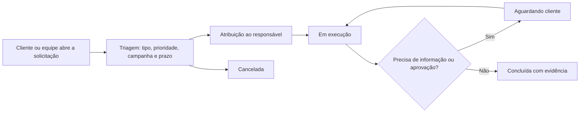

# Trabalho Interdisciplinar — Sistemas Integrados de Gestão Empresarial

## Etapa 02 — Esboço do protótipo

**Aplicação:** Help Desk para Gestão de Tráfego Pago  
**Objetivo do protótipo:** demonstrar como clientes e equipe da agência poderão registrar, acompanhar e concluir demandas de campanhas.

## 1. Delimitação do escopo

O primeiro protótipo será direcionado ao registro e à gestão de solicitações de tráfego pago. Serão consideradas, inicialmente, demandas de criação/alteração/pausa de anúncios, ajuste de orçamento, alteração de público ou segmentação, envio de relatório, análise de métricas e aprovação de criativos.

Não fazem parte do escopo inicial:

- substituir as plataformas Google Ads, Meta Ads ou ferramentas de CRM;
- executar automaticamente alterações nas contas de anúncio;
- coletar dados pessoais sensíveis ou bases de audiência;
- gerar recomendações de IA ou prever resultados de campanha;
- realizar cobrança, faturamento ou gestão financeira completa da agência.

## 2. Esboço do protótipo

### 2.1 Perfis de usuário

| Perfil | Responsabilidades principais |
| --- | --- |
| Cliente | Abrir solicitação, consultar status, enviar informações, aprovar ou solicitar ajuste. |
| Atendimento / gestor de conta | Fazer triagem, definir prioridade e prazo, comunicar-se com o cliente e acompanhar a entrega. |
| Gestor de tráfego | Executar demandas de campanha, registrar evidências e atualizar o status. |
| Administrador | Gerenciar usuários, clientes, tipos de demanda, campanhas e indicadores. |

### 2.2 Fluxo de uma demanda



### 2.3 Estados do ticket

| Status | Significado |
| --- | --- |
| Aberta | Solicitação enviada, ainda sem triagem. |
| Em triagem | Atendimento está conferindo informações, prioridade e prazo. |
| Em execução | A demanda foi atribuída e está sendo realizada. |
| Aguardando cliente | A equipe precisa de informação, aprovação ou material do cliente. |
| Concluída | A entrega foi registrada, com comentário e evidência quando aplicável. |
| Cancelada | A solicitação não será executada, com motivo registrado. |

### 2.4 Tela inicial — painel de demandas

```text
+--------------------------------------------------------------------------------+
| SIGE Desk                         [Nova solicitação]       [Usuário / Perfil] |
+--------------------------------------------------------------------------------+
| Indicadores: [12 abertas] [4 em execução] [3 aguardando cliente] [2 vencidas]|
+------------------------------+-------------------------------------------------+
| Filtros                      | Minhas demandas                                |
| - Cliente                    | #104 Ajustar orçamento - Cliente Alfa          |
| - Campanha                   | Prioridade: Alta | Em execução | vence 22/09   |
| - Tipo de demanda            |                                                 |
| - Prioridade                 | #105 Aprovar criativo - Cliente Beta           |
| - Status                     | Prioridade: Média | Aguardando cliente         |
+------------------------------+-------------------------------------------------+
| Menu: Dashboard | Demandas | Clientes | Campanhas | Relatórios | Administração |
+--------------------------------------------------------------------------------+
```

### 2.5 Tela de abertura de solicitação

```text
Nova solicitação

Cliente:       [selecionar cliente                     ]
Campanha:      [selecionar campanha ou informar nova   ]
Tipo:          [Alteração de campanha                  ]
Canal:         [Google Ads / Meta Ads / outro          ]
Prioridade:    [Baixa | Média | Alta | Urgente          ]
Prazo:         [dd/mm/aaaa                              ]
Assunto:       [_______________________________________]
Descrição:     [_______________________________________]
               [_______________________________________]
Anexos:        [Adicionar arquivo]

[Cancelar]                                              [Enviar solicitação]
```

### 2.6 Informações mínimas de uma demanda

| Grupo | Informações |
| --- | --- |
| Identificação | Número do ticket, cliente, campanha, tipo, canal e solicitante. |
| Controle | Prioridade, responsável, data de abertura, prazo e status. |
| Descrição | Assunto, contexto, pedido, links, anexos e métricas relacionadas. |
| Comunicação | Comentários, menções, resposta ao cliente e histórico de status. |
| Encerramento | Ação realizada, evidência, data de conclusão e motivo de cancelamento, se houver. |

## 3. Critérios iniciais de sucesso

O protótipo será considerado adequado à proposta se permitir:

- registrar uma solicitação sem recorrer a mensagens externas;
- visualizar o status, o responsável e o prazo de cada demanda;
- manter histórico das interações e alterações de status;
- filtrar demandas por cliente, campanha, prioridade e status;
- identificar demandas em atraso ou aguardando resposta do cliente;
- concluir uma demanda registrando a ação executada.
