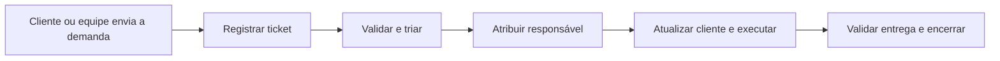

# ITIL 4 Practice Guide — Service Desk

- **Arquivo-fonte:** `671826957-ITIL4-Service-Desk.pdf`.
- **Entidade responsável:** ITIL / PeopleCert.
- **Ano da versão consultada:** 2023.
- **Relevância para o tema:** **5/5**. Fundamenta o Help Desk como ponto de contato, triagem, comunicação e acompanhamento de solicitações.

## Contexto / Motivação

O guia descreve a prática de Service Desk como interface de comunicação entre o provedor de serviço e seus usuários. O atendimento é ponto de entrada e contato único para registrar, acompanhar e encaminhar demandas.

## Problema de pesquisa

Não se aplica. É guia de prática de gestão de serviços.

## Objetivo

Orientar a organização de canais de comunicação, registro de solicitações, triagem, comunicação com usuários, papéis e métricas do Service Desk.

## Hipótese / questão de pesquisa

Não se aplica.

## Trabalhos relacionados / base teórica

Relaciona o Service Desk a práticas como gestão de incidentes, gestão de solicitações de serviço, gestão de nível de serviço, gestão de relacionamento e gestão do conhecimento.

## Metodologia

Apresenta orientação prática por processos, atividades, entradas, saídas, papéis, competências, canais de comunicação e indicadores.

## Resultados

O fluxo de atendimento apresentado inclui reconhecer e registrar a consulta do usuário, validar informações, fazer triagem, iniciar atividades adequadas, manter comunicação e registrar o resultado. O guia destaca que atualizações de status podem ser enviadas automaticamente pelos canais acordados e que o histórico de comunicação cria contexto reutilizável.

Também orienta acompanhar métricas de comunicação e atendimento, em vez de apenas contabilizar volume de tickets.

## Discussão / interpretação

Para o SIGE Desk, o portal de tickets deve ser a fonte principal de registro, mesmo que a demanda chegue inicialmente por outro canal. Atendimento/gestor de conta exerce a triagem; gestor de tráfego executa ou devolve a demanda; cliente acompanha e valida quando necessário.

## Limitações

O guia é amplo e voltado a gestão de serviços em geral. Não determina automaticamente a prioridade, os prazos ou o fluxo de uma agência de tráfego pago.

## Conclusão

Um Help Desk eficaz depende de registro estruturado, comunicação contínua, responsável definido e dados suficientes para encaminhar cada demanda sem perda de contexto.

## Contribuição

Sustenta os requisitos de histórico, comentários, atribuição, notificações, painel e indicadores de prazo do aplicativo.

## Trabalhos futuros

Validar com a agência quais canais serão aceitos, quem faz a primeira triagem, quais mensagens serão automáticas e quais indicadores serão acompanhados mensalmente.

## Validade

Adequada como referencial de processo e operação. Não substitui testes de usabilidade do portal nem uma definição contratual de SLA.

## Generalização

Os princípios de ponto de contato, registro, triagem e comunicação se transferem ao projeto; a configuração de clientes, campanhas e demandas é específica do SIGE Desk.

## Utilidade para minha pesquisa

Usar o fluxo: **registrar → validar → triar → atribuir → comunicar → executar/acompanhar → validar entrega → encerrar ou reabrir**. No painel, acompanhar ao menos tickets abertos, vencidos, aguardando cliente, tempo de primeira resposta e tempo de resolução.

## Observação adicional

O sistema não precisa substituir WhatsApp ou e-mail no MVP, mas toda decisão relevante recebida por esses canais deve ser registrada no ticket para preservar o histórico.

## Guia rápido — como pensar como um Help Desk

| Pergunta | Resposta para o SIGE Desk |
| --- | --- |
| Onde a demanda entra? | No ticket; se vier por WhatsApp ou e-mail, deve ser registrada nele. |
| Quem organiza antes de executar? | Atendimento / gestor de conta faz a triagem. |
| Quem executa? | Gestor de tráfego ou outro responsável atribuído. |
| Como o cliente sabe o que ocorreu? | Pelo status, comentários, notificações e evidências. |
| O que não pode se perder? | Pedido original, responsável, prazo, decisões e histórico. |

**Pergunta para revisar sozinha:** se alguém entrar no ticket amanhã, conseguirá entender o pedido, quem fez cada ação e por que o ticket terminou naquele status?
