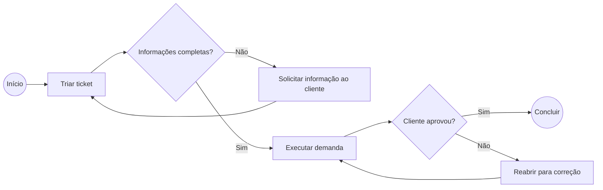

# Business Process Model and Notation (BPMN) 2.0

- **Link da especificação:** [BPMN 2.0](https://www.omg.org/spec/BPMN/2.0/)
- **Arquivo-fonte:** `BPMN.pdf`.
- **Entidade responsável:** Object Management Group (OMG).
- **Ano:** 2011.
- **Relevância para o tema:** **4/5**. Padroniza a representação do fluxo de atendimento, aprovações e comunicação entre cliente e agência.

## Contexto / Motivação

BPMN é uma notação gráfica para modelar processos de negócio e suas interações. Seu objetivo é criar uma linguagem visual compreensível por pessoas de negócio e técnica.

## Problema de pesquisa

Não se aplica. É uma especificação de notação.

## Objetivo

Definir elementos e regras para representar processos, colaborações entre participantes, eventos, atividades, decisões e fluxos.

## Hipótese / questão de pesquisa

Não se aplica.

## Trabalhos relacionados / base teórica

A especificação diferencia processos privados, processos públicos, colaborações e coreografias. Para este projeto, são especialmente relevantes participantes, pools, lanes, tarefas, eventos, gateways e fluxos de sequência/mensagem.

## Metodologia

Especificação formal de elementos gráficos, seus atributos e regras de conexão.

## Resultados

Uma colaboração pode apresentar dois ou mais participantes em pools. Dentro de cada pool, lanes podem evidenciar responsabilidades. Eventos representam início, intermediários ou fim; tarefas representam trabalho; gateways representam decisões; sequence flows mostram a ordem dentro do processo; message flows representam comunicação entre participantes.

## Discussão / interpretação

O fluxo do SIGE Desk pode ser modelado como colaboração entre **Cliente** e **Agência**. Dentro da agência, as lanes podem separar Atendimento/Gestor de conta, Gestor de tráfego e Administrador. Gateways tornam explícitas decisões como “informações suficientes?”, “exige aprovação?” e “entrega aprovada?”.

## Limitações

BPMN modela o processo, mas não substitui requisitos funcionais, regra de negócio, modelo de dados, protótipo de interface ou implementação.

## Conclusão

A notação melhora a comunicação sobre responsabilidades, transições e exceções. O diagrama deve representar o processo real desejado, sem excesso de detalhe técnico.

## Contribuição

Fornece base para revisar o fluxo da Etapa 02 e produzir um diagrama acadêmico do ciclo de vida do ticket.

## Trabalhos futuros

Modelar o processo “As Is” (atual, com mensagens dispersas) e o “To Be” (proposto no SIGE Desk), validando ambos com os usuários.

## Validade

É fonte normativa para modelagem, não para avaliar desempenho, usabilidade ou conformidade legal.

## Generalização

Os elementos BPMN são reutilizáveis em qualquer processo; participantes, atividades e regras concretas dependem da agência.

## Utilidade para minha pesquisa

No diagrama futuro, usar eventos de início/fim, tarefas de triagem e execução, gateways para decisões, pools para Cliente e Agência e message flows apenas nas comunicações entre pools. Evitar usar sequence flow atravessando participantes distintos.

## Observação adicional

O diagrama não precisa representar a execução dentro do Google Ads ou Meta Ads, pois essas plataformas permanecem fora do escopo do MVP.

## Guia rápido — como desenhar o processo

| Elemento BPMN | Como usar no trabalho |
| --- | --- |
| Evento | Marca o início ou fim: “Solicitação recebida” e “Ticket concluído”. |
| Tarefa | Uma ação: “Classificar ticket”, “Executar ajuste” ou “Enviar comentário”. |
| Gateway | Uma pergunta com caminhos: “Cliente aprovou?” ou “Falta informação?”. |
| Pool | Participante externo: Cliente e Agência. |
| Lane | Papel dentro da Agência: Atendimento e Gestor de tráfego. |
| Fluxo de mensagem | Comunicação entre Cliente e Agência. |

**Como fazer sozinha:** comece escrevendo as ações em post-its ou uma lista. Só depois transforme cada ação em tarefa e cada pergunta em gateway. Se o desenho ficar confuso, provavelmente o processo ainda precisa de decisão ou responsabilidade mais clara.
