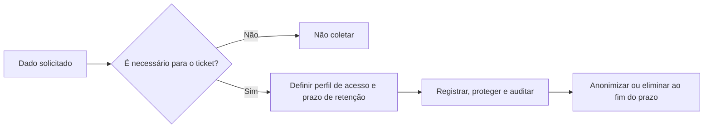

# Lei nº 13.709/2018 — Lei Geral de Proteção de Dados Pessoais (LGPD)

- **Link da lei:** [texto consolidado](https://www.gov.br/mj/pt-br/assuntos/sua-protecao/sedigi/Lei13709.pdf)
- **Arquivo-fonte:** `LGPD.pdf`.
- **Entidade responsável:** Brasil.
- **Ano:** 2018, com alterações posteriores no texto consolidado.
- **Relevância para o tema:** **5/5**. O SIGE Desk tratará dados pessoais operacionais, como nome, e-mail, comentários, histórico e anexos de clientes e equipe.

## Contexto / Motivação

A LGPD regula o tratamento de dados pessoais, inclusive em meios digitais. Tratamento inclui coletar, armazenar, consultar, compartilhar, alterar, eliminar e controlar informações pessoais.

## Problema de pesquisa

Não se aplica. É legislação, não estudo empírico.

## Objetivo

Proteger direitos relacionados a liberdade, privacidade e livre desenvolvimento da personalidade por meio de princípios, deveres e medidas de segurança para o tratamento de dados.

## Hipótese / questão de pesquisa

Não se aplica.

## Trabalhos relacionados / base teórica

São centrais para o projeto os princípios de finalidade, adequação, necessidade, livre acesso, qualidade dos dados, transparência, segurança, prevenção, não discriminação e responsabilização. Também se aplicam regras sobre término do tratamento, direitos do titular, segurança e incidentes.

## Metodologia

Norma legal que define conceitos, hipóteses e princípios de tratamento, direitos dos titulares, responsabilidades dos agentes e sanções.

## Resultados

O tratamento deve ter finalidade legítima e informada, ser compatível com essa finalidade e limitado ao mínimo necessário. A lei prevê direitos de acesso, correção, informação e eliminação em hipóteses aplicáveis. O término do tratamento ocorre quando a finalidade é alcançada, os dados deixam de ser necessários, termina o período de tratamento ou há determinação da autoridade competente.

A lei exige medidas técnicas e administrativas desde a concepção até a execução do serviço, segurança mesmo após o término do tratamento e comunicação de incidentes que possam gerar risco ou dano relevante, nos termos aplicáveis.

## Discussão / interpretação

O MVP não deve solicitar credenciais de anúncios, dados bancários, listas de público ou dados sensíveis. Nome, e-mail profissional, comentários e anexos só devem ser coletados quando necessários para registrar e executar a demanda. A política de retenção de 24 meses deve ser documentada como proposta operacional e revisada de acordo com contrato, finalidade e orientação jurídica.

## Limitações

Esta extração é apoio acadêmico e de requisitos; não substitui análise jurídica da agência, definição da base legal, aviso de privacidade, contrato com clientes ou avaliação de incidente real.

## Conclusão

Privacidade deve ser incorporada ao desenho do sistema, e não adicionada apenas depois da implementação. O histórico do ticket aumenta rastreabilidade, mas deve ter acesso controlado e retenção definida.

## Contribuição

Sustenta os RNFs de privacidade, segurança, backup e retenção, além das regras de acesso por perfil e auditoria.

## Trabalhos futuros

Definir, antes de produção: controlador e operadores envolvidos, base legal por categoria de dado, aviso de privacidade, canal para solicitações de titulares, procedimento de incidente e calendário de descarte/anonimização.

## Validade

É a principal referência legal brasileira para o tratamento de dados pessoais. Sua aplicação concreta depende do contexto de tratamento e de orientação especializada quando necessária.

## Generalização

Os princípios se aplicam a todo o sistema; os dados efetivamente tratados, os contratos e a política de retenção variam conforme a agência e os clientes.

## Utilidade para minha pesquisa

Manter no escopo: autenticação, autorização por perfil, registro de acesso/alteração, mínimo de dados por ticket, retenção de 24 meses proposta, backup protegido e teste de restauração. Incluir no teste a verificação de que um cliente não acessa tickets de outra organização.

## Observação adicional

O requisito de não apagar tickets concluídos sem registro administrativo não elimina a necessidade de revisar a retenção. Ao fim do prazo definido, a solução deve prever anonimização ou eliminação, salvo guarda necessária por obrigação legal ou contratual.

## Guia rápido — checklist de dados do SIGE Desk

| Antes de guardar um dado | Pergunte-se |
| --- | --- |
| **Finalidade** | Por que este dado é necessário para atender a demanda? |
| **Necessidade** | Consigo executar o trabalho com menos dados? |
| **Acesso** | Qual perfil realmente precisa visualizar ou alterar isto? |
| **Histórico** | Preciso registrar a alteração para auditoria? |
| **Retenção** | Até quando o dado e o anexo devem ficar guardados? |
| **Incidente** | Quem será avisado e como o problema será registrado? |

**Aplicação simples no MVP:** guardar nome e e-mail profissional do solicitante pode ser necessário; guardar senha de Google Ads, lista completa de público ou documento sem relação com o ticket não deve ser o padrão.

**Pergunta para revisar sozinha:** se esse dado vazasse, eu conseguiria explicar por que o coletei, quem tinha acesso e quando ele seria eliminado?
