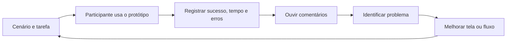

# Usability Analysis of Digital Signature Application Based on ISO 9241-11 Using Retrospective Think Aloud and User Experience Questionnaire

- **Link do artigo:** [https://doi.org/10.1109/ICITSI65188.2024.10929447](https://doi.org/10.1109/ICITSI65188.2024.10929447)
- **Autores:** Ridha Radhitya; Arti Dian Nastiti; Marini Wulandari; Sri Agustiningtyas; Wawan Hermawan; Irfani Ahmad.
- **Ano:** 2024.
- **DOI:** `10.1109/ICITSI65188.2024.10929447`.
- **Relevância para o tema:** **5/5**. É referência direta para avaliar o protótipo por efetividade, eficiência, satisfação e observação de dificuldades de navegação.

## Contexto / Motivação

O estudo avalia a aplicação de assinatura digital DS BRIN, usada em processos administrativos. A motivação é identificar problemas de usabilidade que afetam a adoção e a produtividade do usuário.

## Problema de pesquisa

Como avaliar a usabilidade de uma aplicação de assinatura digital com base na ISO 9241-11, combinando testes de tarefas, Retrospective Think Aloud (RTA) e User Experience Questionnaire (UEQ)?

## Objetivo

Medir efetividade, eficiência e satisfação dos usuários e produzir recomendações de melhoria para a interface.

## Hipótese / questão de pesquisa

Não apresenta hipótese formal. Parte da premissa de que métodos quantitativos e qualitativos combinados revelam problemas que uma única medida não evidenciaria.

## Trabalhos relacionados / base teórica

Usa a ISO 9241-11, que relaciona usabilidade a efetividade, eficiência e satisfação em um contexto de uso. O RTA registra a reflexão do usuário após realizar a tarefa; o UEQ mede percepção da experiência.

## Metodologia

Emprega método misto. Dez usuários iniciantes executaram dez tarefas; especialistas foram usados como referência de desempenho. Foram coletados sucesso e tempo das tarefas, comentários de RTA e respostas ao UEQ.

## Resultados

Os iniciantes concluíram 93% das tarefas, mas a eficiência de processo calculada foi de 45% em comparação com o desempenho de especialistas. O UEQ classificou a maior parte dos aspectos de UX como “Bad”. A dificuldade de navegação foi o problema mais frequente, observada em 29 tarefas.

## Discussão / interpretação

Uma alta taxa de conclusão não garante uma boa experiência: o usuário pode concluir a tarefa, mas gastar tempo excessivo, hesitar ou depender de tentativa e erro. Para o SIGE Desk, a taxa de conclusão, o tempo, a necessidade de ajuda e os comentários devem ser analisados juntos.

## Limitações

O sistema avaliado é uma aplicação de assinatura digital; o público, as tarefas e os riscos não são os mesmos de um Help Desk de marketing. A comparação com especialistas exige tarefas e referência de execução bem definidas.

## Conclusão

A combinação de teste de usabilidade, RTA e UEQ permite localizar problemas de navegação e converter evidências em melhorias de interface.

## Contribuição

Fundamenta a metodologia da Etapa 04 e reforça a necessidade de registrar resultados por tarefa, não apenas uma opinião geral dos participantes.

## Trabalhos futuros

Após os testes do SIGE Desk, classificar cada problema por severidade, causa provável e ação de correção; repetir o teste após mudanças significativas na navegação.

## Validade

Válida para inspirar o método de teste, não para estabelecer a taxa de eficiência esperada do SIGE Desk. Os limiares do projeto devem ser apresentados como critérios internos.

## Generalização

O princípio de combinar medidas objetivas e percepção do usuário se transfere ao projeto; os valores obtidos no artigo não devem ser generalizados para a agência.

## Utilidade para minha pesquisa

No teste com seis participantes, registrar para cada uma das cinco tarefas: conclusão sem ajuda, tempo, erro, ajuda solicitada e comentário posterior. Usar esses registros junto ao UEQ-S para priorizar mudanças no fluxo de abertura, busca, atribuição, validação e reabertura.

## Observação adicional

Antes de comparar tempos entre participantes, definir claramente quando uma tarefa começa e termina e manter o mesmo cenário de teste para todos.

## Guia rápido — como testar se o protótipo é fácil de usar

| Passo | O que fazer |
| --- | --- |
| 1. Preparar | Criar um cenário fictício e as cinco tarefas do teste. |
| 2. Observar | Pedir ao participante que execute sem receber a resposta. |
| 3. Registrar | Marcar concluiu/não concluiu, tempo, erro, ajuda e comentário. |
| 4. Ouvir | Ao terminar, perguntar onde teve dúvida e o que mudaria. |
| 5. Medir | Calcular taxa de conclusão, média de tempo e UEQ-S. |
| 6. Melhorar | Corrigir os problemas mais recorrentes e testar novamente. |

**O aprendizado principal:** “conseguiu concluir” não é suficiente. Se a pessoa concluiu, mas se perdeu na tela, demorou demais ou precisou de ajuda, existe uma melhoria a fazer.

**Pergunta para revisar sozinha:** eu conseguiria explicar por que uma tarefa falhou usando uma evidência observada, e não apenas minha impressão?
