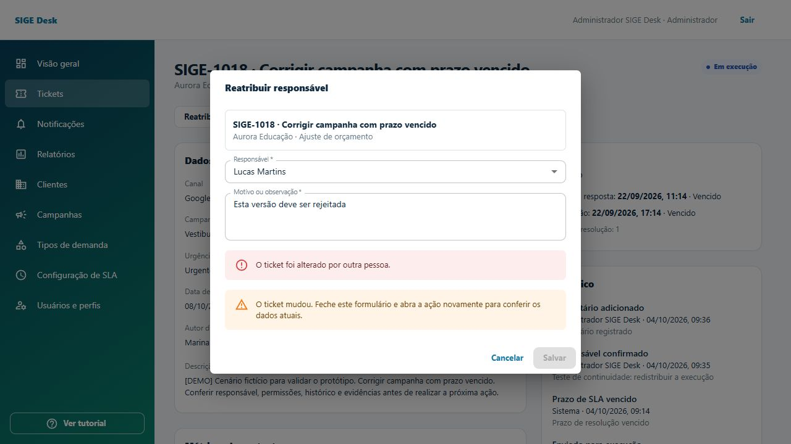

# Revisão técnica e correção dos achados — 04/10/2026

## Resultado

Os achados P1/P2 da [revisão de 03/10](review/revisao-20261003.md) foram corrigidos. A rodada final passou com **47 testes Java** e **296 verificações HTTP**, sem falhas, contra MySQL isolado. TypeScript e build de produção também passaram. A aplicação persiste dados reais no MySQL; a carga demo contém dados fictícios persistidos.

O resultado cobre os cenários executados e as correções abaixo. Não representa certificação de produção, pentest, auditoria completa de acessibilidade, teste de carga ou homologação de todos os navegadores. A revisão anterior permanece preservada para rastreabilidade.

## Correções e evidências

| Achado | Correção | Validação |
| --- | --- | --- |
| Notificação automática de vencimento — RF-20 | Job periódico, bloqueio transacional por ticket e chave única por ticket/prazo/ciclo. Primeira resposta continua sendo verificada durante pausa da resolução; tickets concluídos/cancelados não recebem novos avisos. | Quatro testes do serviço: pausa, deduplicação, novo ciclo e terminal; API confirmou evento `SLA_OVERDUE` no histórico. |
| Campos adicionais tipados e condicionais — RF-22 | Editor e abertura com TEXT, NUMBER, DATE, SELECT e FILE; opções, limites, datas reais, obrigatoriedade condicional e rejeição de campos desconhecidos. Arquivo exige upload real. Rótulos no detalhe vêm do snapshot do tipo. | Seis testes do validador; API rejeitou número/data/opção inválidos, condição ausente e nome de arquivo sem conteúdo; abertura multipart passou. Cliente criou SIGE-1043 na interface com número, data, seleção, condição e briefing. |
| Reatribuição em execução/espera — RF-07 | Comando exclusivo de Atendimento/Admin, gestor ativo, motivo, histórico e notificação. Preserva prazo, prioridade e ciclo; referências e acesso acompanham o novo responsável. | API testou execução e espera, perda de acesso do gestor anterior e tentativa indevida do cliente. Interface reatribuiu SIGE-1018 e preservou prazos. |
| Calendário nacional — RF-23 | Novos snapshots incluem política de feriados nacionais fixos `BR_FIXED_V1`; 20/11 é considerado a partir de 2024. Datas adicionais são configuráveis na regra. | Testes de passagem por 20/11, vigência e tempo útil atravessando feriado/fim de semana. Calendários já congelados continuam com sua política original. |
| Agregações do painel — RF-15 | Distribuições por prioridade, responsável e estado dos prazos, com agregação SQL e escopo do perfil. Estados de prazo são mutuamente exclusivos. | Para seis contas, somas de prioridade/responsável fecharam com o total visível e soma dos prazos fechou com os ativos. Painel conferido no navegador. |
| Formulário desatualizado | `TicketItem.version` e `If-Match` obrigatório nos comandos. Versão ausente retorna 428; versão antiga retorna 409 `VERSION_CONFLICT`. Formulário mantém a versão aberta e bloqueia reenvio até reabertura. Upload também altera a versão do ticket, protegendo contra transição concorrente. | API testou versão antiga e ausente. No navegador, outra sessão alterou o ticket e a submissão antiga exibiu conflito com Salvar desabilitado. |
| Vencidos e tempo útil — RF-16/RF-21 | Indicador individual na tabela/Kanban; filtro `overdue` em lista, relatório e CSV; detalhe mostra minutos úteis anteriores à classificação. | Filtro HTTP retornou somente itens vencidos para os seis usuários; relatório e lista concordaram. Tabela/Kanban e detalhe conferidos na interface. |
| E-mail duplicado — RF-03 | Validação de duplicidade sem diferenciar maiúsculas; conflito de integridade concorrente convertido em 409. | API rejeitou cadastro repetido com 400, sem 500. |
| Paginação/escala | Tickets, cadastros e notificações filtrados/paginados no banco; painel usa agregações e recentes limitados. Referências filtradas por consultas SQL. | API exercitou busca, limite, página inválida, escopo e notificações não lidas. Busca de cadastro preservou foco no navegador. Relatório/CSV continuam incluindo todos os resultados filtrados. |
| Contrato e tipos | OpenAPI completo gerado pelo backend, schemas com nomes únicos, enums e nulabilidade; sessão, CSRF, `If-Match`, erros, logout e criação multipart documentados. Tipos TypeScript gerados e utilizados pelo cliente HTTP. | Sincronização do contrato e TypeScript passaram; geração offline reproduz o arquivo versionado. |
| Arquivos órfãos após rollback | Limpeza do arquivo em `afterCompletion` quando a transação não confirma; abertura multipart engloba ticket e arquivos na mesma transação. | API enviou primeiro arquivo válido e segundo inválido: nenhum ticket persistido e nenhuma alteração no conjunto de arquivos do armazenamento. |
| Auditoria de retomada — RF-09/RF-17 | Recalcular prazo de resolução registra evento dedicado com prazo anterior/novo e motivo. | Jornada de complemento/retomada verificou `RESOLUTION_DEADLINE_CHANGED`; os testes de pausa útil continuam passando. |

Os percursos anteriores continuam passando: autenticação/CSRF/logout, isolamento de organizações, triagem, evidência, aprovação/correção, dois ciclos, dispensa de aprovação, complementos por comentário/anexo, cancelamento, CRUD, proteções de continuidade, referências, relatórios e CSV.

## Calendário e dados existentes

A política automática cobre os feriados nacionais de data fixa definidos na [Lei 662/1949](https://www.planalto.gov.br/ccivil_03/leis/l0662.htm), [Lei 6.802/1980](https://www.planalto.gov.br/ccivil_03/leis/l6802.htm) e [Lei 14.759/2023](https://www.planalto.gov.br/ccivil_03/_ato2023-2026/2023/lei/l14759.htm). Feriados locais, religiosos e recessos são informados em `holidays`; pontos facultativos não são tratados automaticamente como feriados nacionais.

A política fica congelada no snapshot de cada nova classificação. Não se reescrevem os calendários de tickets antigos para alterar silenciosamente seus prazos. A V4 preserva os limites de recuperação histórica já descritos na revisão anterior: não reconstrói pausas/calendários que nunca foram registrados.

A V5 cria o controle de vencimentos e índices de consulta; a V6 remove um índice de notificações redundante, preservando o índice equivalente da V1. As seis migrations passaram em MySQL 8.0.40, tanto em base vazia quanto na atualização da base de testes. A V5 pode emitir aviso transitório de índice duplicado no MySQL atual; a V6 deixa apenas o índice original.

A limpeza de arquivos cobre rollback normal e falha de commit. Uma interrupção abrupta do processo antes do callback continua exigindo reconciliação operacional entre armazenamento e banco; não há transação distribuída com o filesystem. Não foi executado teste de recuperação de desastre.

## Evidências e ambiente

- [296 verificações HTTP](review/fixes-api-results.json), em dez cenários, com seis contas. A contagem inclui status HTTP e assertivas; não são 296 testes unitários independentes. A quantidade pode variar quando a verificação do job encontra seu primeiro evento em outro ticket.
- [47 testes Java](review/fixes-test-summary.json), zero falhas, erros ou ignorados; inclui teste de migration real em MySQL.
- TypeScript e build de produção passaram. Gráficos e Kanban foram separados em chunks; o maior arquivo ficou abaixo de 500 KB. Restam avisos de comentários de dependência Zod removidos pelo Rollup, sem falha de build.
- Navegador: login/logout, agregações, filtros tabela/Kanban, busca paginada, editor dos cinco tipos, reatribuição, formulário desatualizado, abertura com briefing e retorno após sessão expirada. Capturas abaixo. Atualizações locais durante a execução produziram mensagens transitórias de HMR; a checagem da versão de produção é separada.



Outras capturas: [filtro de vencidos](review/ui-fixes-overdue.png), [reatribuição persistida](review/ui-fixes-reassignment.png), [ticket com campos tipados](review/ui-fixes-typed-ticket.png).

Testes realizados em `sige_desk_fixes_20261004_v2`, API 8081 e frontend 5174. Migrations também validadas em `sige_desk_fixes_migration_final_20261004`. O banco principal `sige_desk` e os servidores originais 8080/5173 foram preservados. As bases de teste e evidências foram mantidas. O backend original aplica as novas migrations quando reiniciado.

## Reproduzir

Usar instância demo e armazenamento separados; o roteiro cria dados fictícios e não deve apontar para o banco principal. O script aceita somente `http://localhost:8081/api/v1`; a porta não identifica o banco, portanto confirme `SIGE_DB_URL` ao iniciar.

```powershell
# Em Backend, terminal da instância isolada
$env:SIGE_DB_URL = 'jdbc:mysql://localhost:3306/sige_desk_fixes_test?useSSL=false&allowPublicKeyRetrieval=true&serverTimezone=UTC'
$env:SIGE_DEMO_PASSWORD = '123'
$env:SIGE_ADMIN_PASSWORD = '123'
$env:SIGE_STORAGE_PATH = 'target/fixes-uploads'
$env:SIGE_ALLOWED_ORIGIN = 'http://localhost:5174'
.\mvnw.cmd spring-boot:run '-Dspring-boot.run.profiles=demo' '-Dspring-boot.run.arguments=--server.port=8081'
# Outro terminal, Backend
python scripts/review_flows.py --output target/fixes-api-results.json
.\mvnw.cmd test
# Frontend
$env:SIGE_API_TARGET = 'http://localhost:8081'
pnpm dev --port 5174 --strictPort
pnpm api:sync http://localhost:8081/v3/api-docs
pnpm build
```

O teste MySQL exige `SIGE_TEST_DB_URL`, `SIGE_TEST_DB_USERNAME` e `SIGE_TEST_DB_PASSWORD` com outra base vazia, conforme README. Contas demo usam senha `123` quando criadas nessa configuração; reiniciar não redefine contas existentes.
