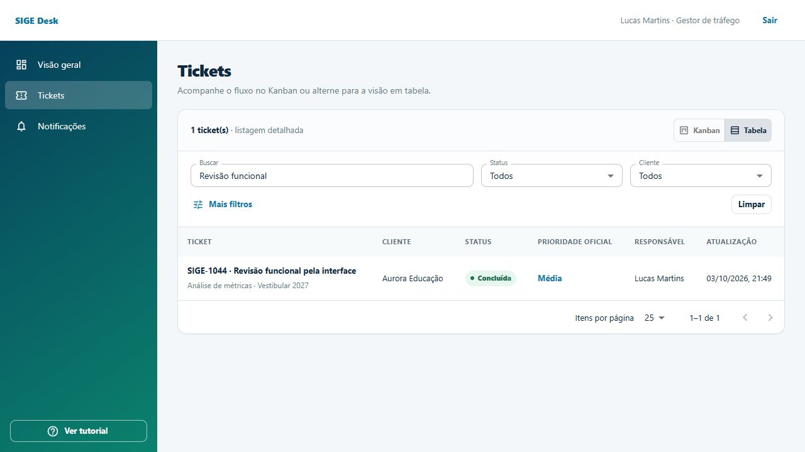

# Revisão técnica e funcional da entrega — 03/10/2026

## Parecer

A aplicação tem backend funcional e persistência real em MySQL. Os dados demo são uma carga fictícia persistida, não respostas mockadas do frontend. Depois das correções desta revisão, os percursos críticos testados passaram. **A entrega ainda não atende integralmente à especificação e não deve ser declarada concluída sem as pendências abaixo.**

A revisão combinou leitura do código, confronto com a especificação, testes de regressão, API autenticada contra MySQL e interação no navegador. Referências: `Trabalho/Documentacao do Projeto/Especificacao/Especificacao do sistema.md`, levantamento de atores, `PLANO-DE-IMPLEMENTACAO.md`, matriz de permissões e código do protótipo em `Prototipo-SIGE-Desk`. A inspeção funcional desta rodada não constitui uma nova comparação visual exaustiva de todas as telas com o protótipo publicado.

## Achados que permanecem

### P1 — Não existe emissão de notificação ao vencer um prazo

`Backend/src/main/java/br/pucminas/sige/notifications/application/NotificationService.java:20` publica eventos somente quando chamado por comandos. Não existe agendamento ou processamento que detecte a passagem do prazo e publique o evento de vencimento. Um ticket pode aparecer vencido no painel sem avisar os envolvidos. Isso deixa **RF-20 parcial**. Implementar detecção periódica e deduplicação por ticket, prazo e ciclo, respeitando pausa e escopo dos destinatários. O envio por e-mail permanece opcional e não foi certificado nesta revisão.

### P1 — Campos adicionais são tratados como texto, sem condições ou validação por tipo

`Frontend/src/app/App.tsx:40`, `Frontend/src/shared/components/ManagementSettings.tsx:9` e `Backend/src/main/java/br/pucminas/sige/tickets/application/TicketService.java` implementam nome/rótulo e obrigatoriedade booleana. Número, data, seleção, anexo, opções, condições e regras específicas descritos na especificação não são executados. A API aceita valores textuais para esses campos; salvar metadados extras no JSON não implementa a validação. **RF-22 parcial**, considerando seus critérios detalhados. O snapshot de configuração foi corrigido, mas o editor e a validação ainda precisam implementar esses tipos.

### P1 — Não há reatribuição durante execução ou espera

`Backend/src/main/java/br/pucminas/sige/tickets/application/TicketService.java:46` altera responsável dentro de `triage`; `Ticket.classify` limita os estados aceitos. Não há comando específico para Atendimento/Admin reatribuir uma demanda já em execução ou aguardando cliente. A proteção contra inativar responsáveis com tickets ativos funciona, mas falta a operação de continuidade indicada pela matriz de permissões e pelo cenário de inativação. **RF-07 parcial nos critérios ampliados**. Implementar reatribuição autorizada, com motivo, histórico, notificações e manutenção dos prazos.

### P1 — Feriados nacionais não são incluídos automaticamente no calendário padrão

`Backend/src/main/java/br/pucminas/sige/sla/application/SlaService.java` usa apenas a lista de feriados cadastrada na regra. A especificação determina que o calendário padrão exclua feriados nacionais, além dos feriados/recessos cadastrados. Configurar uma lista manual funciona, mas uma regra padrão sem esses registros conta feriados como dias úteis. **RF-23 parcial nos critérios detalhados**. Definir carga/calendário nacional por ano e testar a passagem por feriados.

### P2 — O painel não apresenta todas as agregações exigidas

`Backend/src/main/java/br/pucminas/sige/dashboard/api/DashboardController.java:20` retorna distribuição por status, total de prioridade alta/urgente e contadores gerais; não retorna distribuição por responsável nem por todas as prioridades. **RF-15 parcial**. Acrescentar agregações e exibi-las no frontend respeitando o escopo do perfil.

### P2 — Controle de concorrência não identifica formulários desatualizados

`Ticket` tem `@Version`, mas `TicketDtos` e os comandos do frontend não enviam a versão lida. O Hibernate detecta duas transações simultâneas que concorrem pela mesma versão; uma segunda submissão feita depois da primeira recarrega a versão atual e pode sobrescrever uma classificação ainda permitida, sem informar que o formulário estava desatualizado. Acrescentar versão esperada/ETag e teste com duas sessões. A presença de `409 VERSION_CONFLICT` no tratamento de erros não comprova esse cenário.

### P2 — Identificação e filtragem de vencidos ainda estão incompletas na listagem

O detalhe e os contadores identificam vencimento, mas `TicketItem`, tabela e Kanban não oferecem uma indicação individual de SLA vencido ou filtro específico de vencimento. O cenário CT-06 prevê filtrar tickets vencidos. Antes da classificação também falta mostrar o tempo útil transcorrido, exigido na regra de SLA. **RF-16 e RF-21 parciais nos critérios ampliados**.

### P2 — Cadastro de cliente com e-mail duplicado retorna 500

Reproduzido na API ao repetir um e-mail já registrado: a restrição `clients.uk_clients_email` gera `DataIntegrityViolationException` sem tratamento específico. `ClientController` não verifica duplicidade e `ApiExceptionHandler` não converte esse conflito em erro de formulário/409. O fluxo normal de criação/edição/inativação passou, mas esse caso precisa de mensagem útil e teste de regressão.

### P2 — Escala, contrato e persistência de anexos precisam de acabamento

A paginação de tickets ocorre depois de carregar o escopo inteiro e filtrar em memória (`TicketService.filtered`); cadastros/notificações também carregam listas completas. Isso funciona com a carga demo, mas não foi certificado com volume de produção. O arquivo OpenAPI versionado não descreve integralmente os schemas/retornos da API; os tipos TypeScript são mantidos manualmente. A escrita do arquivo acontece antes do commit da transação e pode deixar arquivo órfão se o commit falhar. Tratar esses pontos antes de considerar robustez operacional comprovada.

## Problemas corrigidos nesta revisão

- Triagem retornando 500 no MySQL: os valores anteriores de campanha/tipo eram UUIDs sem aspas em colunas JSON do histórico. Corrigida a serialização e exercitada a triagem real.
- Pausa de resolução sem compensar o prazo: os intervalos de pausa agora são preservados e descontam apenas horas úteis; o prazo de primeira resposta não é pausado.
- Reabertura após conclusão reutilizando o ciclo antigo: cria novo ciclo com novo marco inicial e exige reconfirmação antes da execução; preserva a primeira resposta e registra o ciclo anterior no histórico. Correção durante validação permanece no mesmo ciclo.
- Configuração do tipo/calendário alterando tickets em andamento: execução usa os requisitos congelados no ticket; o SLA guarda dias, horários, fuso, feriados e prazos no snapshot. A precedência passou a cliente+tipo, cliente, tipo, padrão.
- Complemento por comentário/anexo não sendo reconhecido: agora marca recebimento e mantém a espera até conferência do Atendimento/Admin.
- Possibilidade de bloquear a continuidade por mudança de perfil/vínculo: protegidos responsável com tickets ativos, último Cliente ativo de organização aguardando resposta/validação, último Administrador e última regra padrão, inclusive ao alterar o escopo.
- Referências de formulário fora do escopo e possível acesso lazy fora da transação: referências de Cliente/Gestor limitadas ao vínculo e carregadas em transação.
- Anexos: ajuste do limite multipart para 10 MB, registro no histórico, notificações e download com nome original; links de execução aceitam apenas HTTP/HTTPS.
- Autenticação: rotação da sessão após login, resposta 401 para ausência de autenticação e limpeza do cache/redirecionamento ao expirar sessão no frontend.
- CSV: neutralização de valores que poderiam ser interpretados como fórmulas.
- Frontend: criação do ticket separada do envio de anexos para evitar repetir a criação quando um upload falha; falhas são mostradas no detalhe para reenvio. Rótulos dos selects associados, estado de SLA separado para resposta/resolução, erros de upload visíveis e relatórios invalidados após comandos.
- Painel e relatório passaram a usar os mesmos estados de primeira resposta/resolução, considerando pausas e cumprimento fora do prazo.

A migration **V4** acrescenta os intervalos de pausa e o marco do ciclo. Em dados anteriores, calendários ausentes no snapshot são preenchidos com a regra disponível na migração: não é possível recuperar retroativamente uma configuração histórica que nunca foi armazenada. Também não é possível reconstruir todas as pausas/ciclos antigos sem registros suficientes. As correções de preservação valem para os novos eventos; a migração não deve ser apresentada como reconstrução histórica completa.

## Matriz de requisitos

“Verificado” significa implementação encontrada e percurso correspondente testado, dentro do ambiente e dos casos descritos. Não significa prova de ausência de defeitos em todas as combinações possíveis.

| Requisito | Situação | Evidência ou limite |
| --- | --- | --- |
| RF-01 Autenticação | Verificado | Login válido/inválido, conta inativa, sessão, CSRF e logout na API; login/saída dos quatro perfis no navegador. |
| RF-02 Perfis | Verificado | Ações indevidas negadas, isolamento de organizações, gestor limitado à atribuição e referências filtradas. |
| RF-03 Clientes | Verificado com pendência | Criar/editar/inativar; cliente inativo bloqueia novos vínculos. Duplicidade de e-mail ainda retorna 500. |
| RF-04 Campanhas | Verificado | Atendimento criou, editou e inativou campanha; cliente inativo rejeitado e opção inativa retirada das referências. |
| RF-05 Abertura | Verificado | API e interface; prioridade oficial ausente antes da triagem, solicitante/autor e campanha não cadastrada. |
| RF-06 Identificador | Verificado | Numeração persistida e identificadores distintos nos tickets criados. Teste de estresse concorrente não executado. |
| RF-07 Classificação/atribuição | Parcial | Triagem e atribuição passaram; falta reatribuição em execução/espera. |
| RF-08 Transições | Verificado | Execução pelo responsável e pré-condições; comandos por outros perfis rejeitados. |
| RF-09 Auditoria | Parcial | Status, responsável, prioridade, prazos, aprovação e ciclos registrados. Mudanças de prazo por retomada não recebem evento dedicado com prazo anterior/novo. |
| RF-10 Comentários/anexos | Verificado | Comentários, upload de 2 MB, download, histórico e bloqueio de outra organização. |
| RF-11 Validação/complemento | Verificado | Aprovar, pedir correção e complemento por comentário/anexo; retomada depende de conferência. |
| RF-12 Execução/evidência | Verificado | Evidência obrigatória conforme snapshot, URL inválida rejeitada e execução registrada pela API/interface. |
| RF-13 Cancelamento | Verificado | Cancelar antes da execução, motivo obrigatório no contrato e cancelado somente consulta. |
| RF-14 Filtros | Verificado no conjunto implementado | Filtros definidos no contrato e paginação; busca real no navegador; lista/relatório/CSV coerentes para o filtro testado. |
| RF-15 Painel | Parcial | Faltam agregações por responsável/todas as prioridades. |
| RF-16 Vencidos/espera | Parcial | Estados e contadores presentes; falta filtro de vencidos do caso de aceite e indicação individual na listagem. |
| RF-17 Histórico | Parcial | Histórico consultável, ciclo anterior preservado; falta evento explícito de alteração do prazo por retomada. |
| RF-18 Métricas | Verificado na implementação | Contrato com métricas numéricas e limites; contexto específico preenchido e persistido no navegador. Nem toda combinação numérica foi testada por HTTP. |
| RF-19 Exportação | Verificado | CSV usa todos os resultados filtrados, controle de perfil, escape e proteção contra fórmula. |
| RF-20 Notificações | Parcial | Eventos dos comandos persistidos e leitura por usuário validada; falta evento automático de vencimento. |
| RF-21 SLA | Parcial | Prazos/estados, pausa e ciclos corrigidos; falta tempo útil antes da classificação. |
| RF-22 Tipos | Parcial | CRUD, obrigatoriedade textual e snapshots; faltam tipos/condições/opções/validação avançada. |
| RF-23 Calendário | Parcial | Horas úteis, escopos, feriados cadastrados e calendário congelado; falta calendário nacional padrão. |

| Requisito não funcional | Resultado |
| --- | --- |
| RNF-02 Segurança | Sessão/CSRF, hash e escopo revisados; verificações de autorização passaram. Não constitui pentest ou validação de configuração de produção. |
| RNF-03 Privacidade | Carga e evidências fictícias; escopo restringe tickets, anexos e notificações. Conteúdo sensível escrito voluntariamente em texto livre não é detectado automaticamente. |
| RNF-04 Rastreabilidade | Parcial: ver RF-09/RF-17; registros anteriores à correção têm os limites históricos descritos. |
| RNF-05 Integridade | Não existe comando de exclusão de ticket na API revisada; cancelamento preserva consulta. |
| RNF-07 Compatibilidade | Percurso validado no navegador integrado Chromium. Firefox, Safari e outras versões não foram executados nesta rodada. |
| RNF-09 Acessibilidade | Rótulos de selects corrigidos e leitura da árvore acessível conferida. Auditoria completa de teclado, leitor de tela e contraste permanece pendente. |

## Execução e evidências

- **33 testes Java passaram, zero falhas, zero erros, zero ignorados.** Nove casos adicionados para calendário congelado, precedência, pausa útil, resposta vencida durante pausa, novo ciclo, calendário inválido e snapshots/transições. Fixture de relatório ajustada para registrar uma primeira resposta cumprida; relatório agora considera ambos os prazos.
- **160 checks HTTP passaram**: positivos e negativos em sete cenários. Incluem seis contas (quatro perfis, outra organização e outro gestor), aprovação/correção, dois ciclos, dispensa de aprovação, complemento, anexos, bloqueios de cadastros, CRUD, referências, painel, relatório, CSV, paginação, notificações, CSRF e logout. Checks incluem status HTTP e assertivas de negócio; não são 160 testes unitários independentes.
- **MySQL 8.0.40**: V1–V4 aplicadas em banco vazio; V4 também aplicada à base de revisão que já tinha V1–V3 e carga demo. Reinício validou os checksums e não repetiu o seed.
- **Frontend**: TypeScript e build de produção passaram. Permanece aviso de chunk de aproximadamente 777 KB (243 KB gzip); não houve medição de desempenho em rede lenta.
- **Navegador**: login e logout por perfil; menus; cliente abriu SIGE-1044; atendimento iniciou/classificou/atribuiu; gestor executou com evidência e dispensa de aprovação; detalhe/histórico/SLA atualizados; busca e Kanban/tabela. Nenhum erro ou aviso de console foi capturado nesse percurso.

Evidências versionadas: [resultado da API](review/api-results.json), [resumo Java](review/test-summary.json), [ticket concluído](review/ui-ticket-completed.jpg), [listagem filtrada](review/ui-ticket-list.jpg). O roteiro reproduzível está em [Backend/scripts/review_flows.py](../Backend/scripts/review_flows.py).



O teste usou `sige_desk_review_20261003` na porta 8081 e `sige_desk_migration_review_20261003` para migrations, com frontend temporário na porta 5174. O banco principal `sige_desk` e os servidores originais nas portas 8080/5173 não foram alterados pelos testes. As instâncias temporárias foram encerradas; bases e evidências de teste foram preservadas. As alterações de código e a V4 entram no backend original quando ele for reiniciado.

## Reproduzir a revisão

Usar banco demo separado, recém-criado, contas com senha local `123` e backend na porta 8081. O roteiro cria dados fictícios e deve rodar apenas nessa instância de testes; a verificação de porta no script não identifica qual banco um servidor usa.

```powershell
# Em SIGE-Desk/Backend, terminal do backend isolado
$env:SIGE_DB_URL = 'jdbc:mysql://localhost:3306/sige_desk_review?useSSL=false&allowPublicKeyRetrieval=true&serverTimezone=UTC'
$env:SIGE_DEMO_PASSWORD = '123'
$env:SIGE_ADMIN_PASSWORD = '123'
$env:SIGE_STORAGE_PATH = 'target/review-uploads'
$env:SIGE_ALLOWED_ORIGIN = 'http://localhost:5174'
.\mvnw.cmd spring-boot:run '-Dspring-boot.run.profiles=demo' '-Dspring-boot.run.arguments=--server.port=8081'

# Outro terminal, mesma pasta
python scripts/review_flows.py
```

Para testes Java, `mvnw.cmd test`. Para incluir MySQL, configurar `SIGE_TEST_DB_URL`, `SIGE_TEST_DB_USERNAME` e `SIGE_TEST_DB_PASSWORD` para outra base vazia de testes antes de executar. Para frontend isolado, definir `SIGE_API_TARGET=http://localhost:8081` e iniciar Vite na porta 5174. Os comandos originais de instalação continuam nos READMEs do front e do back.
