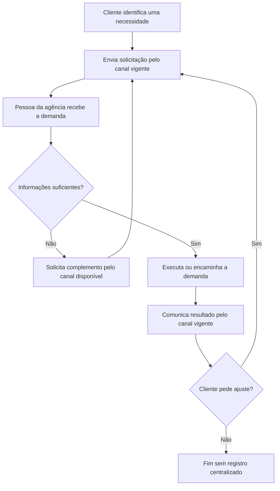

# Processo As Is — gestão atual de demandas de tráfego pago

**Aplicação:** Help Desk para Gestão de Demandas de Tráfego Pago

> Este modelo representa uma hipótese analítica construída a partir da problemática e do referencial do artigo. Não descreve factual ou empiricamente a rotina de uma agência específica.

## 1. Por que registrar o As Is

Para este trabalho, o As Is é recomendado como um diagnóstico breve: ele organiza hipóteses sobre dispersão de solicitações, indefinição de responsáveis e perda de contexto que motivam a proposta do SIGE Desk. Não é necessário detalhar todas as variações de cada agência nem incluí-lo como figura principal do artigo; o To Be continua sendo o modelo de processo da solução proposta.

## 2. Hipótese do processo atual

Este diagrama não descreve uma rotina já comprovada de agência. Ele registra uma hipótese analítica: uma solicitação é recebida pelo canal vigente, alguém da agência verifica as informações, a demanda é executada ou encaminhada e a resposta retorna ao cliente. Caso não exista um registro comum, pedido, responsável, prazo, decisão, aprovação e evidência podem ficar distribuídos em pontos de contato distintos. O modelo não pressupõe canais ou papéis específicos; a derivação dos perfis e limites do MVP está registrada no [levantamento de requisitos](../Levantamento%20de%20requisitos.md).

## 3. Hipóteses de limitação a validar

- solicitações e decisões distribuídas entre canais distintos;
- dificuldade de identificar responsável, prioridade e prazo;
- ausência de histórico único de mudanças, evidências e aprovações;
- retrabalho quando o cliente solicita correção;
- dificuldade de acompanhar demandas vencidas ou aguardando resposta.

## 4. Uso acadêmico do diagnóstico

O As Is é usado somente para contrastar a problemática fundamentada no referencial com o processo futuro proposto. Não é uma coleta de campo nem deve ser apresentado como diagnóstico factual. Caso o escopo do projeto passe a incluir pesquisa empírica, o procedimento, os participantes e os cuidados éticos deverão ser definidos antes de qualquer coleta.
