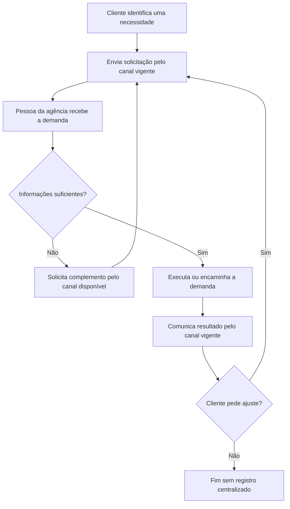

# Processo As Is — gestão atual de demandas de tráfego pago

**Aplicação:** Help Desk para Gestão de Demandas de Tráfego Pago

> Este modelo representa a hipótese inicial do processo atual, construída a partir da problemática do artigo. Ele deverá ser validado com potenciais usuários antes de ser tratado como descrição factual da rotina de uma agência específica.

## 1. Por que registrar o As Is

Para este trabalho, o As Is é recomendado como um diagnóstico breve: ele evidencia a dispersão de solicitações, a indefinição de responsáveis e a perda de contexto que justificam a proposta do SIGE Desk. Não é necessário detalhar todas as variações de cada agência nem incluí-lo como figura principal do artigo; o To Be continua sendo o modelo de processo da solução proposta.

## 2. Hipótese do processo atual

Este diagrama não descreve uma rotina já comprovada de agência. Ele registra uma hipótese de processo a ser confrontada com potenciais usuários: uma solicitação é recebida pelo canal vigente, alguém da agência verifica as informações, a demanda é executada ou encaminhada e a resposta retorna ao cliente. Caso não exista um registro comum, pedido, responsável, prazo, decisão, aprovação e evidência podem ficar distribuídos em pontos de contato distintos. Os canais e papéis efetivamente utilizados devem ser registrados no [levantamento de requisitos](../Levantamento%20de%20requisitos.md).

## 3. Limitações observadas a validar

- solicitações e decisões dispersas entre canais;
- dificuldade de identificar responsável, prioridade e prazo;
- ausência de histórico único de mudanças, evidências e aprovações;
- risco de retrabalho quando o cliente solicita correção;
- dificuldade de acompanhar demandas vencidas ou aguardando resposta.

## 4. Validação mínima

O responsável por processo e requisitos deve confirmar, com pelo menos dois potenciais usuários ou pessoas que conheçam a rotina, se os canais, papéis, pontos de retrabalho e lacunas acima correspondem à prática. As diferenças devem ser registradas neste arquivo e refletidas no [processo To Be](BPMN%20-%20Processo%20To%20Be.md), nos requisitos e no artigo quando alterarem a caracterização do problema.
