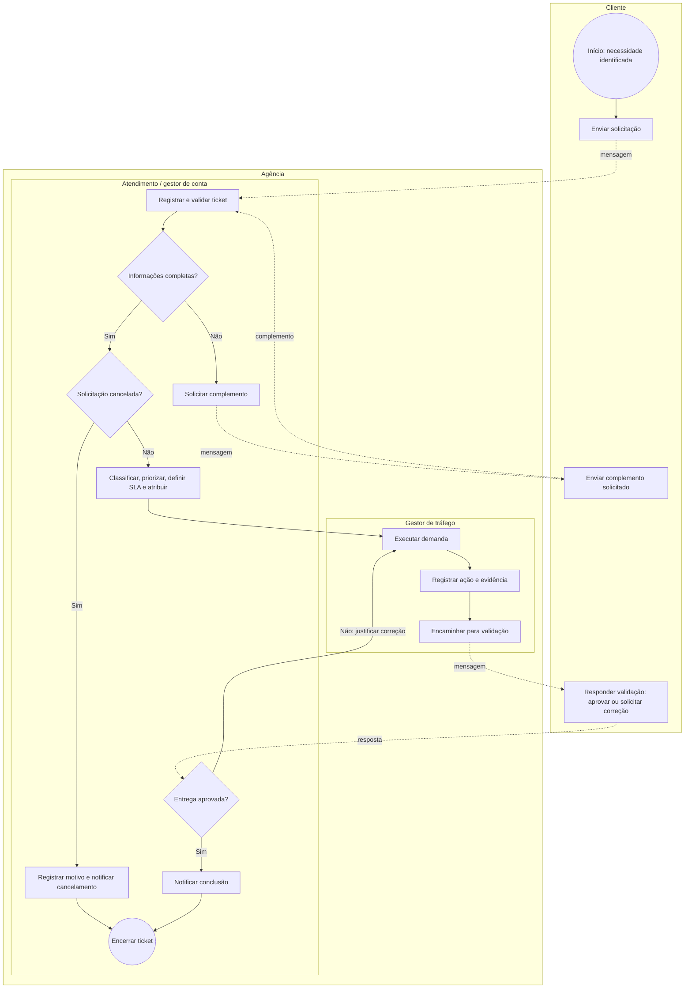

# Processo To Be — Gestão de demandas de tráfego pago

**Aplicação:** Help Desk para Gestão de Demandas de Tráfego Pago

> Modelo de processo baseado nos elementos da Business Process Model and Notation (BPMN) 2.0.2. Ele representa o fluxo desejado do SIGE Desk; não representa automações dentro de Google Ads, Meta Ads ou ferramentas de gestão do relacionamento com o cliente (CRM).

## 1. Objetivo do processo

Transformar solicitações recebidas por canais dispersos em tickets rastreáveis, com triagem, responsável, prazo, comunicação, validação e encerramento registrados.

## 2. Participantes e responsabilidades

| Pool / lane BPMN | Responsabilidade no processo |
| --- | --- |
| Cliente | Abrir a demanda, complementar informações e aprovar ou solicitar correção. |
| Agência — Atendimento / gestor de conta | Validar a entrada, classificar, priorizar, atribuir, comunicar e acompanhar o acordo de nível de serviço (SLA). |
| Agência — Gestor de tráfego | Executar a demanda, registrar ação/evidência e encaminhar para validação. |
| Agência — Administrador | Administrar cadastros, regras, acessos e configurações do processo. |

## 3. Fluxo futuro (To Be)

## 4. Regras de leitura

- Os retângulos representam tarefas; losangos representam decisões; círculos representam início ou fim.
- Setas sólidas mostram a sequência de atividades dentro da agência; setas pontilhadas representam mensagem entre Cliente e Agência.
- O status **Aguardando cliente** é usado após a solicitação de complemento; o prazo de resolução fica pausado nesse período.
- O status **Em validação** começa após o registro da ação e da evidência; uma reprovação gera **Reaberta**, sem apagar o histórico.
- Cancelamento pode ocorrer antes da execução, com motivo registrado, por Atendimento ou Administrador.

## 5. Como validar o modelo

Em entrevista ou teste de requisitos, perguntar a cada perfil:

1. Esta é a sequência realista para sua rotina?
2. Em que momento o cliente precisa aprovar ou complementar informações?
3. Quem pode alterar prioridade, prazo, responsável e status?
4. Que evidência deve existir antes de concluir cada tipo de demanda?
5. Em qual etapa geralmente ocorre retrabalho hoje?

## Referência

- OBJECT MANAGEMENT GROUP. *Business Process Model and Notation (BPMN), Version 2.0.2*. Needham, 2014. Disponível em: [especificação BPMN](https://www.omg.org/spec/BPMN/2.0.2/). Acesso em: 16 ago. 2026.
