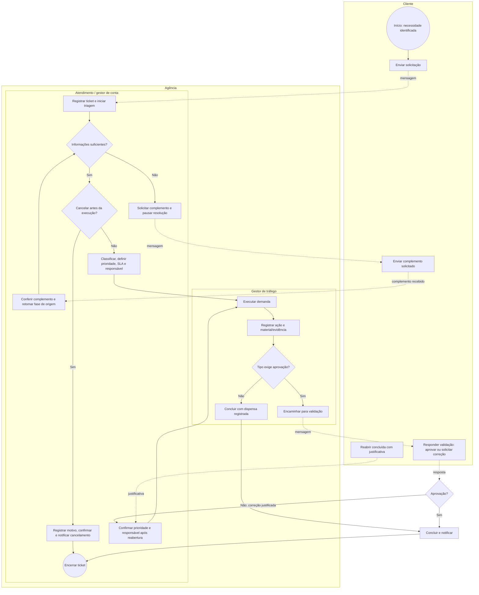

# Processo To Be — Gestão de demandas de tráfego pago

**Aplicação:** Help Desk para Gestão de Demandas de Tráfego Pago

> Modelo de processo baseado nos elementos da Business Process Model and Notation (BPMN) 2.0.2. Ele representa o fluxo desejado do SIGE Desk; não representa automações em plataformas de anúncios, *publishers* digitais ou ferramentas de gestão do relacionamento com o cliente (CRM). Os participantes e o limite entre atores externos e perfis do sistema estão documentados em [Levantamento de requisitos.md](../Levantamento%20de%20requisitos.md).

## 1. Objetivo do processo

Oferecer um fluxo de tickets rastreáveis para demandas de tráfego pago, com triagem, responsável, prazo, comunicação, validação e encerramento registrados.

## 2. Participantes e responsabilidades

Os quatro perfis abaixo são definidos para o processo proposto. Anunciante/cliente, agência, *publishers* e plataformas de troca de anúncios são atores do contexto da publicidade digital. No MVP, o acesso é limitado ao perfil Cliente e aos perfis internos da Agência; *publishers* e plataformas não possuem conta ou integração automática.

| Pool / lane BPMN | Responsabilidade no processo |
| --- | --- |
| Cliente | Abrir a demanda, enviar complemento, aprovar ou solicitar correção em validação e reabrir demanda concluída. |
| Agência — Atendimento / gestor de conta | Validar a entrada, classificar, priorizar, calcular SLA, atribuir, solicitar e conferir complemento, retomar, cancelar antes da execução, comunicar e acompanhar. |
| Agência — Gestor de tráfego | Executar demanda atribuída, registrar ação e material/evidência e encaminhar para validação ou conclusão conforme a regra do tipo. |
| Agência — Administrador | Administrar cadastros, regras, acessos e configurações e executar as ações de continuidade atribuídas ao Atendimento. Não aprova em nome do Cliente nem registra execução em nome do responsável. |

## 3. Fluxo futuro (To Be)

## 4. Regras de leitura

- Os retângulos representam tarefas; losangos representam decisões; círculos representam início ou fim.
- Setas sólidas mostram a sequência de atividades dentro da agência; setas pontilhadas representam mensagem entre Cliente e Agência.
- A abertura registra o momento de início, mas o SLA fica **pendente de classificação** até Atendimento ou Administrador definir a prioridade. Os prazos são então calculados desde a abertura, sem usar urgência informada como prioridade automática.
- O status **Aguardando cliente** registra informação necessária, fase de origem e se a execução iniciou. O prazo de resolução fica pausado até Atendimento ou Administrador confirmar que o complemento é suficiente e retomar a mesma fase; aguardo iniciado na execução não pode ser cancelado.
- O status **Em validação** começa somente para tipo que exige aprovação e após o registro da ação e do material/evidência configurado. Tipo sem aprovação pode ser concluído diretamente com a dispensa registrada pela configuração.
- Correção solicitada em validação gera **Reaberta** e mantém o ciclo de resolução. Reabertura de demanda concluída exige justificativa, preserva o ciclo anterior e inicia um novo; nos dois casos Atendimento ou Administrador confirma prioridade e responsável antes de liberar nova execução.
- Cancelamento pode ocorrer antes da execução, com motivo e confirmação registrados, por Atendimento ou Administrador.
- As mensagens e setas entre participantes representam transferência de trabalho ou comunicação, não redirecionamento da sessão autenticada. Cada perfil acessa a tarefa permitida a partir do detalhe do ticket.

## 5. Limites do modelo

O modelo foi derivado do referencial, das normas e dos requisitos preliminares. Por isso, ele delimita uma proposta de MVP e não afirma uma rotina universal de agências. Os seguintes pontos permanecem como limites explícitos do projeto:

1. os canais utilizados por agências não são especificados;
2. a estrutura de cargos pode variar entre organizações;
3. regras específicas de aprovação, SLA e evidência são configuráveis no sistema;
4. integrações com plataformas de anúncios, *publishers* e CRM não fazem parte do MVP.

## Referência

- OBJECT MANAGEMENT GROUP. *Business Process Model and Notation (BPMN), Version 2.0*. Needham, 2011. Disponível em: [especificação BPMN](https://www.omg.org/spec/BPMN/2.0/). Acesso em: 16 ago. 2026.
