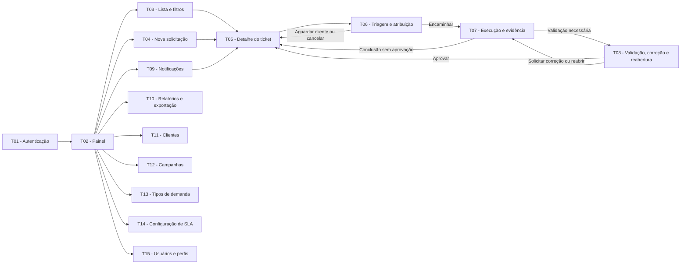

# SIGE Desk — Documentação de orientação para telas

**Aplicação:** Help Desk para Gestão de Demandas de Tráfego Pago  
**Finalidade:** orientar a equipe responsável por criar o protótipo, sem definir layout, cores, componentes ou desenhos visuais.

## 1. Uso deste documento

Este documento informa **quais telas devem existir, o que cada uma deve permitir, quais campos são obrigatórios e como as telas se conectam**. A equipe de interface deve transformar essas orientações em protótipo de baixa fidelidade, decidindo a composição visual e a forma dos componentes.

Os requisitos, regras de negócio, estados, perfis e SLAs são mantidos na [Especificação do sistema](../Especificacao/Especificacao%20do%20sistema.md). O fluxo de negócio de origem está no [BPMN — Processo To Be](../Processo/BPMN%20-%20Processo%20To%20Be.md), e os perfis estão no [Levantamento de requisitos](../Levantamento%20de%20requisitos.md). Esta documentação apenas os traduz para a interface; não cria requisitos novos.

## 2. Quantidade de telas

O protótipo deverá conter **15 telas navegáveis**. Confirmações, mensagens de erro/sucesso, menus, estados vazios, filtros abertos e variações de status do ticket são variantes da tela principal e não devem ser contados como telas novas.

| Grupo | Códigos | Quantidade |
| --- | --- | ---: |
| Acesso e acompanhamento | T01 a T05 | 5 |
| Tratamento de ticket | T06 a T08 | 3 |
| Comunicação e consulta | T09 e T10 | 2 |
| Administração | T11 a T15 | 5 |
| **Total** |  | **15** |

## 3. Regras de interface válidas para todas as telas

- Mostrar identificação do SIGE Desk, usuário autenticado e perfil ativo.
- Restringir menus, dados e ações ao perfil. O Cliente só pode consultar tickets da própria organização.
- Usar rótulos claros, campos obrigatórios identificados, contraste adequado e navegação possível por teclado.
- Apresentar retorno de carregamento, sucesso, erro, ausência de resultado e acesso negado quando necessário.
- Usar dados fictícios. Não solicitar ou mostrar credenciais de plataformas de anúncios, bases de audiência ou dados sensíveis.
- Não apresentar ação para excluir tickets concluídos ou cancelados. O histórico deve permanecer consultável.
- Nas telas que tratam um ticket, exibir, quando aplicável, número, status, prioridade oficial, responsável e prazo/SLA.

## 4. Especificação das telas

### T01 — Autenticação

| Item | Orientação |
| --- | --- |
| Finalidade | Permitir o acesso seguro e encaminhar o usuário para a visão permitida. |
| Perfis | Usuário não autenticado. |
| Campos obrigatórios | E-mail ou usuário; senha. |
| Ações | Entrar; recuperação de acesso, se o grupo decidir representá-la. |
| Regras | Após êxito, abrir T02. Bloquear rotas internas sem sessão. Informar credencial inválida sem revelar se o e-mail existe. |
| Cobertura | RF-01, RF-02, RNF-02. |

### T02 — Painel de demandas

| Item | Orientação |
| --- | --- |
| Finalidade | Oferecer visão resumida do trabalho e atalhos para os caminhos mais usados. |
| Perfis | Todos, com dados limitados pela permissão. |
| Conteúdo obrigatório | Indicadores por status, prioridade, responsável e prazo; destaques para vencidos e aguardando cliente; lista resumida de demandas; atalho para nova solicitação; atalhos para lista, notificações e telas administrativas permitidas. |
| Ações | Abrir ticket; abrir T03 com filtro aplicado; abrir T04; abrir T09; navegar para telas administrativas. |
| Regras | Totais e lista respeitam permissões. Selecionar ticket abre T05. |
| Cobertura | RF-02, RF-15, RF-16, RF-21, RN-09, RN-12. |

### T03 — Lista e filtros de tickets

| Item | Orientação |
| --- | --- |
| Finalidade | Localizar, acompanhar e exportar demandas. |
| Perfis | Todos, com resultados restritos à permissão. |
| Conteúdo obrigatório | Busca; filtros de cliente, campanha, tipo, prioridade, responsável, status e período; quantidade de resultados; lista com número, assunto, cliente, campanha, prioridade, status, responsável, prazo e situação de vencimento/pausa. |
| Ações | Aplicar/limpar filtros; abrir T05; exportar lista filtrada quando autorizado. |
| Regras | Cliente não vê nem filtra organizações alheias. A exportação contém somente o resultado filtrado e autorizado. |
| Cobertura | RF-02, RF-14, RF-16, RF-19, RF-21, RN-09, RN-12. |

### T04 — Nova solicitação

| Item | Orientação |
| --- | --- |
| Finalidade | Registrar demanda para a posterior triagem. |
| Perfis | Cliente; Atendimento quando registrar em nome do cliente. |
| Campos obrigatórios | Cliente; tipo de demanda; urgência informada; assunto; descrição; solicitante. |
| Campos condicionais ou opcionais | Campanha existente ou indicação de não cadastrada; canal; prazo desejado; métricas de contexto (impressões, CTR, CPC, conversão, CPA e ROAS); anexos; campos adicionais configurados pelo tipo. |
| Ações | Cancelar; enviar solicitação. |
| Regras | Cliente é preenchido e bloqueado para o perfil Cliente. Campanha deve pertencer ao cliente escolhido. Ao enviar, gerar identificador, status `Aberta` e abrir T05. Prioridade oficial e SLA não são definidos nesta tela. |
| Cobertura | RF-04, RF-05, RF-06, RF-10, RF-18, RF-22, RN-01, RN-02. |

### T05 — Detalhe, comunicação e histórico do ticket

| Item | Orientação |
| --- | --- |
| Finalidade | Centralizar a consulta da demanda e as interações de seus participantes. |
| Perfis | Todos os perfis autorizados para o ticket. |
| Conteúdo obrigatório | Número, assunto, cliente, campanha, tipo, canal, solicitante, responsável, urgência informada, prioridade oficial, status, datas, prazos de primeira resposta e resolução, situação do SLA, descrição, métricas, anexos, comentários, histórico, ação executada, evidência e aprovação quando existentes. |
| Ações | Adicionar comentário/anexo; abrir T06, T07 ou T08 conforme perfil e estado; consultar histórico completo. |
| Regras | Histórico informa data/hora, autor, campo, valor anterior, novo valor e motivo, quando aplicável. Só mostrar ações permitidas pelo perfil e pelo estado. Cliente não altera prioridade, prazo, responsável ou status fora da validação. |
| Cobertura | RF-02, RF-08, RF-09, RF-10, RF-17, RF-18, RF-21, RN-04, RN-09, RN-13, RN-14, RNF-04, RNF-05. |

### T06 — Triagem e atribuição

| Item | Orientação |
| --- | --- |
| Finalidade | Completar, classificar e encaminhar a demanda para execução. |
| Perfis | Atendimento / gestor de conta; Administrador. |
| Campos obrigatórios para execução | Classificação; prioridade oficial; responsável; prazos de SLA; registro da primeira resposta efetiva. |
| Campos condicionais | Informação complementar solicitada; motivo de cancelamento. |
| Ações | Encaminhar para execução; aguardar cliente; cancelar. |
| Regras | Antes da execução, exigir prioridade, prazo e responsável. `Aguardando cliente` exige a informação faltante e pausa a resolução. `Cancelar` exige motivo e só é permitido antes da execução. Alterações são registradas no histórico e notificam os envolvidos. |
| Cobertura | RF-07, RF-08, RF-09, RF-13, RF-20, RF-21, RN-03, RN-07, RN-08, RN-12, RN-13, RN-14. |

### T07 — Registro de execução e evidência

| Item | Orientação |
| --- | --- |
| Finalidade | Registrar o trabalho realizado antes da validação ou conclusão. |
| Perfis | Gestor de tráfego responsável; Atendimento e Administrador, quando autorizados. |
| Campos obrigatórios | Descrição da ação executada; evidência se exigida pelo tipo de demanda. |
| Campos opcionais/condicionais | Comentário; anexo; link de evidência; informação complementar solicitada. |
| Ações | Encaminhar para validação; concluir quando o tipo dispensar aprovação; aguardar cliente. |
| Regras | Se a configuração do tipo exigir evidência, impedir o encaminhamento sem ela. `Em validação` registra histórico e notifica participantes. Tipo sem aprovação precisa registrar explicitamente a dispensa antes da conclusão. Não representar execução automática em plataformas de anúncios. |
| Cobertura | RF-08, RF-10, RF-12, RF-20, RF-22, RN-04, RN-05, RN-06, RN-10, RN-13. |

### T08 — Validação, correção e reabertura

| Item | Orientação |
| --- | --- |
| Finalidade | Registrar a decisão sobre a entrega e preservar o ciclo da demanda. |
| Perfis | Cliente em `Em validação`; Atendimento e Administrador, conforme regra. |
| Conteúdo obrigatório | Resumo da ação executada; evidências; decisão; campo de observação/justificativa. |
| Ações | Aprovar entrega; solicitar correção; reabrir ticket concluído. |
| Regras | Aprovação altera para `Concluída`. Correção altera para `Reaberta` e retorna à execução. Reabertura exige justificativa, preserva histórico e inicia novo ciclo de resolução. Cliente não pode fazer outras transições. |
| Cobertura | RF-09, RF-11, RF-17, RF-20, RF-21, RN-04, RN-06, RN-11, RN-13. |

### T09 — Central de notificações

| Item | Orientação |
| --- | --- |
| Finalidade | Exibir os eventos que exigem acompanhamento de cada usuário. |
| Perfis | Todos os usuários autenticados. |
| Conteúdo obrigatório | Lista por data; situação lida/não lida; número do ticket; resumo; data/hora; filtro por evento e leitura. |
| Ações | Abrir o ticket relacionado; marcar como lida. |
| Regras | Exibir somente notificações de tickets permitidos. Demonstrar atribuição, comentário, aguardo de cliente, validação, vencimento, conclusão e reabertura. |
| Cobertura | RF-20, RN-12, RN-13. |

### T10 — Relatórios e exportação

| Item | Orientação |
| --- | --- |
| Finalidade | Apoiar a consulta gerencial de tickets. |
| Perfis | Administrador e demais perfis que receberem a permissão. |
| Conteúdo obrigatório | Filtros de T03; resumo do resultado; lista retornada; período e filtros ativos. |
| Ações | Aplicar/limpar filtros; exportar lista filtrada. |
| Regras | Não calcular automaticamente métricas de campanha nem apresentar dados não autorizados. |
| Cobertura | RF-14, RF-19, RN-09. |

### T11 — Administração de clientes

| Item | Orientação |
| --- | --- |
| Finalidade | Manter clientes disponíveis para novas solicitações. |
| Perfis | Administrador. |
| Conteúdo obrigatório | Lista com nome, contato e status; busca/filtro de status; formulário de identificação e contato. |
| Ações | Cadastrar; editar; ativar; inativar. |
| Regras | Confirmar ativação/inativação. Cliente inativo não pode ser selecionado em T04; vínculos históricos são preservados. |
| Cobertura | RF-03, RNF-05. |

### T12 — Administração de campanhas

| Item | Orientação |
| --- | --- |
| Finalidade | Manter campanhas ligadas ao cliente correto. |
| Perfis | Administrador; Atendimento quando autorizado. |
| Campos obrigatórios | Cliente; nome da campanha; canal; objetivo; status. |
| Ações | Cadastrar; editar; ativar; inativar. |
| Regras | Impedir gravação sem cliente válido. Só campanhas ativas e compatíveis aparecem em T04. Preservar os vínculos já usados em tickets. |
| Cobertura | RF-04, RN-02. |

### T13 — Administração de tipos de demanda

| Item | Orientação |
| --- | --- |
| Finalidade | Configurar os tipos disponíveis e suas regras operacionais. |
| Perfis | Administrador. |
| Campos obrigatórios | Nome; status; campos adicionais obrigatórios; necessidade de aprovação; necessidade de evidência. |
| Ações | Cadastrar; editar; ativar; inativar. |
| Regras | A configuração afeta novos tickets. T04 e T07 devem reagir aos campos, à aprovação e à evidência definidos. Tipos inativos não aparecem em novas solicitações. Consultar o catálogo inicial na especificação. |
| Cobertura | RF-22, RN-05, RN-06, RN-10. |

### T14 — Configuração de SLA

| Item | Orientação |
| --- | --- |
| Finalidade | Configurar calendário e prazos que serão usados na triagem e no acompanhamento. |
| Perfis | Administrador. |
| Campos obrigatórios | Fuso horário; dias e horário de atendimento; feriados/recessos; prazos de primeira resposta e resolução por prioridade. |
| Campos opcionais | Regra específica por cliente e por tipo de demanda. |
| Ações | Salvar; editar; desativar regra. |
| Regras | Destacar regra padrão e exceções. Informar que urgência não substitui prioridade oficial, que `Aguardando cliente` pausa a resolução e que `Em validação` não pausa, salvo configuração. Impedir regra incompleta. |
| Cobertura | RF-21, RF-23, RN-12, RN-14. |

### T15 — Administração de usuários e perfis

| Item | Orientação |
| --- | --- |
| Finalidade | Manter os acessos dos quatro perfis do MVP. |
| Perfis | Administrador. |
| Campos obrigatórios | Nome; e-mail; perfil; status; cliente vinculado quando o perfil for Cliente. |
| Ações | Cadastrar; editar; ativar; inativar. |
| Regras | Explicar permissões de Cliente, Atendimento, Gestor de tráfego e Administrador. Perfil Cliente deve estar vinculado a uma organização. Não expor senha em texto; registrar alterações relevantes para auditoria. |
| Cobertura | RF-01, RF-02, RN-09, RNF-02. |

## 5. Fluxo de navegação entre telas

O diagrama apresenta os caminhos de navegação que devem ser conectados no protótipo. As opções administrativas partem do painel e só devem aparecer para o perfil Administrador; os demais caminhos dependem da permissão e do estado do ticket.

### 5.1 Fluxo principal — abertura até conclusão

1. T01 autentica o usuário e encaminha para T02.
2. Cliente ou Atendimento abre T04 a partir de T02. O envio cria o ticket e abre T05.
3. Atendimento ou Administrador abre T06 por T05, faz a triagem e encaminha o ticket para execução.
4. Gestor de tráfego abre T07 por T05, registra execução e evidência.
5. Quando houver aprovação, T07 encaminha para T08. Cliente aprova e o ticket fica `Concluída`; se pedir correção, fica `Reaberta` e retorna a T07.
6. T05 acompanha todo o ciclo, e T09 mostra as notificações produzidas em cada evento.

### 5.2 Fluxo de complemento

1. Em T06 ou T07, usuário autorizado marca `Aguardando cliente`, informa o que falta e gera notificação.
2. Cliente acessa T05, envia comentário ou anexo com o complemento.
3. Atendimento retoma a triagem ou a execução em T06/T05. A interface deve indicar que o SLA estava pausado e foi retomado.

### 5.3 Fluxo de cancelamento

1. Antes da execução, Atendimento ou Administrador usa T06 para cancelar.
2. O sistema exige motivo e confirmação.
3. T05 mostra status `Cancelada`, motivo e histórico, sem ação de exclusão.

### 5.4 Fluxo administrativo

1. Administrador acessa T11 a T15 pelo menu autorizado de T02.
2. Dados cadastrados refletem nas telas operacionais: cliente/campanha em T04; tipos em T04 e T07; SLA em T05 e T06; perfis em toda a navegação.
3. Ao inativar um cadastro, ele deixa de estar disponível em novos registros, sem apagar tickets anteriores.

## 6. Variantes que o protótipo deve demonstrar

As variantes abaixo podem ser cópias de T05 ou de seus formulários; não entram na contagem das 15 telas.

| Status | O que demonstrar |
| --- | --- |
| Aberta | Identificador gerado, solicitante, urgência informada e visibilidade para Atendimento. |
| Em triagem | Classificação, prioridade, SLA e responsável. |
| Em execução | Registro de trabalho, comentário e evidência. |
| Aguardando cliente | Informação solicitada, pausa de SLA e possibilidade de complementar. |
| Em validação | Ação executada, evidência e decisões de aprovar/corrigir. |
| Concluída | Aprovação ou dispensa registrada e opção de reabrir com justificativa. |
| Reaberta | Justificativa preservada e retorno à execução. |
| Cancelada | Motivo registrado e bloqueio de continuidade. |

Demonstrar também, ao menos uma vez: lista vazia, acesso negado, campo obrigatório não preenchido, erro de envio, operação concluída com sucesso e confirmação antes de cancelar, concluir, aprovar, solicitar correção, reabrir, ativar ou inativar.

## 7. Matriz de cobertura

| Referência | Telas de evidência | Evidência mínima no protótipo |
| --- | --- | --- |
| RF-01 e RF-02; RNF-02 | T01, T05, T15 | Login e menu por perfil; ação sem permissão bloqueada. |
| RF-03 | T11, T04 | Cliente ativado/inativado e inativo indisponível na abertura. |
| RF-04; RN-02 | T12, T04 | Campanha vinculada e seleção incompatível bloqueada. |
| RF-05 e RF-06; RN-01 | T04, T05 | Formulário mínimo gera número e status `Aberta`. |
| RF-07; RN-03 | T06, T05 | Triagem registra prioridade, prazo e responsável. |
| RF-08 | T05, T06, T07 | Perfil autorizado realiza transição permitida. |
| RF-09, RF-17; RNF-04 | T05 | Histórico com autor, data/hora, valores e motivo. |
| RF-10 | T04, T05, T07 | Comentário e anexo vinculados ao ticket. |
| RF-11; RN-04, RN-11 | T08, T05 | Aprovação conclui; correção/reabertura exige justificativa. |
| RF-12; RN-05 e RN-06 | T07, T08 | Ação e evidência antecedem validação/conclusão. |
| RF-13; RN-07 | T06, T05 | Cancelamento exige motivo antes da execução. |
| RF-14 e RF-19 | T03, T10 | Filtros completos e exportação do resultado filtrado. |
| RF-15 e RF-16 | T02, T03 | Indicadores e destaque de vencidos/aguardo. |
| RF-18 | T04, T05 | Métricas de contexto ficam registradas. |
| RF-20; RN-12 e RN-13 | T09, T05 | Eventos notificados a destinatários autorizados. |
| RF-21; RN-14 | T05, T06, T14 | Prazos, primeira resposta, pausa e vencimento visíveis. |
| RF-22; RN-10 | T13, T04, T07 | Tipo define campos, aprovação e evidência. |
| RF-23 | T14, T06, T05 | Configuração de calendário e regra aplicada ao prazo. |
| RNF-03 e RNF-05 | Todas; T05 | Dados mínimos fictícios e nenhum ticket encerrado excluído. |
| RNF-07 e RNF-09 | Todas | Interface responsiva, clara, com contraste e teclado previstos. |
| BPMN To Be e transições | T04 a T08 | Abertura, complemento, triagem, execução, validação, correção e encerramento seguem o processo. |

## 8. Checklist de entrega para a equipe de interface

- [ ] Há 15 telas navegáveis identificadas de T01 a T15.
- [ ] Os quatro fluxos de navegação foram ligados: principal, complemento, cancelamento e administrativo.
- [ ] Existem variantes para os oito estados do ticket.
- [ ] Há ao menos um caminho demonstrado para Cliente, Atendimento, Gestor de tráfego e Administrador.
- [ ] T05 apresenta histórico, permissões e situação de SLA.
- [ ] T13 e T14 demonstram que a configuração afeta T04, T06 ou T07.
- [ ] Todos os itens RF-01 a RF-23, RN-01 a RN-14 e RNF aplicáveis foram conferidos na matriz.
- [ ] O protótipo não inclui integração automática com Google Ads/Meta Ads, execução automática de alterações, IA, cálculo automático de métricas, faturamento ou chat externo ao ticket.

## 9. Limites deste documento

Este guia não define identidade visual, biblioteca de componentes, tecnologia ou arquitetura. Integrações automáticas com plataformas de anúncios, execução automática de mudanças, recomendações por inteligência artificial, cálculo automático de métricas, faturamento e chat em tempo real externo ao histórico do ticket permanecem fora do escopo do MVP.
