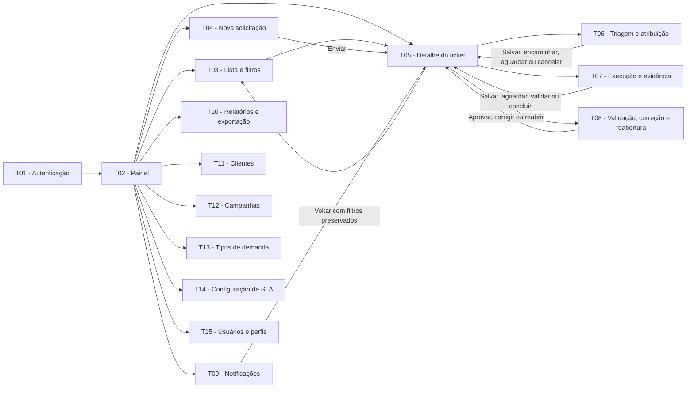

# SIGE Desk — Documentação de orientação para telas

**Aplicação:** Help Desk para Gestão de Demandas de Tráfego Pago  
**Finalidade:** orientar a equipe responsável por criar o protótipo, sem definir layout, cores, componentes ou desenhos visuais.

## 1. Uso deste documento

Este documento informa **quais telas devem existir, o que cada uma deve permitir, quais campos são obrigatórios e como as telas se conectam**. A equipe de interface deve transformar essas orientações em protótipo de baixa fidelidade, decidindo a composição visual e a forma dos componentes.

Os requisitos, regras de negócio, estados, perfis e SLAs são mantidos na [Especificação do sistema](../Especificacao/Especificacao%20do%20sistema.md). O fluxo de negócio de origem está no [BPMN — Processo To Be](../Processo/BPMN%20-%20Processo%20To%20Be.md), e os perfis estão no [Levantamento de requisitos](../Levantamento%20de%20requisitos.md). Esta documentação apenas os traduz para a interface; não cria requisitos novos.

## 2. Quantidade de telas

O protótipo deverá conter **15 telas navegáveis**. Confirmações, mensagens de erro/sucesso, menus, estados vazios, filtros abertos e variações de status do ticket são variantes da tela principal e não devem ser contados como telas novas.

Para simplificar a navegação, T04, T06, T07 e T08 são superfícies contextuais e não aparecem no menu principal. T04 abre como painel lateral pelas ações `Abrir ticket` ou `Novo ticket`. T06, T07 e T08 são abertas diretamente quando o usuário seleciona em T02, T03 ou T09 um ticket cujo estado e permissão exigem triagem, execução ou validação. Os códigos continuam preservados para rastreabilidade dos requisitos e testes.

| Grupo | Códigos | Quantidade |
| --- | --- | ---: |
| Acesso e acompanhamento | T01 a T05 | 5 |
| Tratamento de ticket | T06 a T08 | 3 |
| Comunicação e consulta | T09 e T10 | 2 |
| Administração | T11 a T15 | 5 |
| **Total** |  | **15** |

## 3. Regras de interface válidas para todas as telas

- Mostrar identificação do SIGE Desk, usuário autenticado e perfil ativo.
- Restringir menus, dados e ações ao perfil. O Cliente só pode consultar tickets da própria organização.
- Usar rótulos claros, campos obrigatórios identificados, contraste adequado e navegação possível por teclado.
- Apresentar retorno de carregamento, sucesso, erro, ausência de resultado e acesso negado quando necessário.
- Usar dados fictícios. Não solicitar ou mostrar credenciais de plataformas de anúncios, bases de audiência ou dados sensíveis.
- Não apresentar ação para excluir tickets concluídos ou cancelados. O histórico deve permanecer consultável.
- Nas telas que tratam um ticket, exibir, quando aplicável, número, status, prioridade oficial, responsável e prazo/SLA.
- Transferências de trabalho entre perfis não redirecionam a sessão autenticada: depois de uma ação, a sessão retorna a T05; o próximo perfil acessa o ticket por T02, T03 ou T09 e abre somente a ação permitida.
- Ações de voltar preservam o filtro de origem em T03; cancelar um formulário sem envio não altera o ticket.

### Tutorial guiado por perfil

O tutorial é uma orientação transversal às telas e não conta como uma nova tela. No primeiro acesso de cada conta, ele destaca os controles relevantes e navega pelas áreas necessárias para explicar o trabalho daquele perfil. Cada etapa oferece `Anterior`, `Próximo` e `Pular`; a última oferece `Concluir`. Abrir ou percorrer o tutorial não altera dados, status, prioridade, responsável ou prazos dos tickets.

| Perfil | Percurso orientado |
| --- | --- |
| Cliente | Painel; abertura de solicitação; Kanban/tabela; acompanhamento do fluxo e validação contextual; notificações. |
| Atendimento / gestor de conta | Painel operacional; Kanban; triagem contextual; relatórios; campanhas. |
| Gestor de tráfego | Painel de trabalho atribuído; Kanban; execução contextual; notificações. |
| Administrador | Painel geral; Kanban; triagem contextual; clientes; SLA; usuários e perfis. |

A conclusão ou o cancelamento do roteiro fica registrado por conta no navegador do protótipo. O usuário pode reiniciar seu roteiro pela ação `Ver tutorial`, disponível junto ao perfil no menu lateral. A restauração da base de demonstração também restaura a oferta inicial do tutorial.

## 4. Especificação das telas

### T01 — Autenticação

| Item | Orientação |
| --- | --- |
| Finalidade | Permitir o acesso seguro e encaminhar o usuário para a visão permitida. |
| Perfis | Usuário não autenticado. |
| Campos obrigatórios | E-mail; senha. |
| Ações | Entrar; sair a partir do menu autenticado. |
| Regras | Após êxito, abrir T02. Conta inativa, credencial inválida e sessão expirada mostram retorno genérico sem revelar se o e-mail existe. Bloquear rotas internas sem sessão. Recuperação de acesso e envio real de e-mail não fazem parte do protótipo navegável. |
| Cobertura | RF-01, RF-02, RNF-02. |

### T02 — Painel de demandas

| Item | Orientação |
| --- | --- |
| Finalidade | Oferecer visão resumida do trabalho e atalhos para os caminhos mais usados. |
| Perfis | Todos, com dados limitados pela permissão. |
| Conteúdo obrigatório | Indicadores por status, prioridade, responsável e prazo; destaques para vencidos, prazo pendente de classificação e aguardando cliente; lista resumida de demandas; atalhos autorizados para lista, notificações, nova solicitação e administração. |
| Ações | Abrir o painel T04 pela ação `Abrir ticket`; abrir T03 com filtro aplicado; abrir T09; navegar somente para áreas recorrentes e telas administrativas autorizadas. |
| Regras | Totais e lista respeitam permissões. Selecionar um ticket abre T06, T07 ou T08 quando houver ação contextual permitida para o perfil e estado; nos demais casos, abre T05. Atendimento e Administrador também podem abrir T12; somente Administrador vê T11, T13, T14 e T15. |
| Cobertura | RF-02, RF-15, RF-16, RF-21, RN-09, RN-12. |

### T03 — Lista e filtros de tickets

| Item | Orientação |
| --- | --- |
| Finalidade | Localizar, acompanhar e exportar demandas. |
| Perfis | Todos, com resultados restritos à permissão. |
| Conteúdo obrigatório | Busca; filtros de cliente, campanha, tipo, prioridade, responsável, status, período de abertura e situação de SLA; quantidade de resultados; Kanban principal agrupado por status; opção de tabela com número, assunto, cliente, campanha, prioridade, status, responsável, prazo de primeira resposta, prazo de resolução e situação de vencimento, pausa ou classificação pendente. |
| Ações | Alternar entre Kanban e tabela; aplicar/limpar filtros; selecionar ticket para abrir T05 ou a etapa contextual permitida; Atendimento/Admin exportar resultado filtrado. |
| Regras | O Kanban é a visualização inicial. Busca e filtros produzem o mesmo conjunto de resultados nas duas visualizações. Cliente não vê nem filtra organizações alheias; Gestor de tráfego vê somente demandas atribuídas. `Período` significa data de abertura. A exportação contém somente o resultado filtrado e autorizado. Voltar de T05 restaura os filtros aplicados. |
| Cobertura | RF-02, RF-14, RF-16, RF-19, RF-21, RN-09, RN-12. |

### T04 — Painel de nova solicitação

| Item | Orientação |
| --- | --- |
| Finalidade | Registrar demanda para a posterior triagem. |
| Perfis | Cliente; Atendimento ou Administrador quando registrar em nome do cliente. |
| Campos obrigatórios | Cliente; tipo de demanda; urgência informada; assunto; descrição; solicitante. |
| Campos condicionais ou opcionais | Campanha existente ou indicação de não cadastrada, caso em que a identificação mínima da campanha é obrigatória; canal; prazo desejado; métricas de contexto (impressões, CTR, CPC, conversão, CPA e ROAS), com unidade/moeda e período; anexos; campos adicionais configurados pelo tipo. |
| Ações | Cancelar; enviar solicitação. |
| Regras | Cliente é preenchido e bloqueado para o perfil Cliente. Atendimento/Admin registra autor do envio e solicitante representado. Campanha existente deve pertencer ao cliente; campanha não cadastrada é resolvida na triagem, com cadastro/vínculo antes da execução. Ao enviar, gerar identificador, status `Aberta`, registrar SLA como `Pendente de classificação` e abrir T05. Prioridade oficial não é definida nesta tela. Zero em métrica é valor informado; campo vazio é não informado. |
| Cobertura | RF-04, RF-05, RF-06, RF-10, RF-18, RF-22, RN-01, RN-02. |

### T05 — Detalhe, comunicação e histórico do ticket

| Item | Orientação |
| --- | --- |
| Finalidade | Centralizar a consulta da demanda e as interações de seus participantes. |
| Perfis | Todos os perfis autorizados para o ticket. |
| Conteúdo obrigatório | Número, assunto, cliente, campanha ou identificação pendente, tipo e regra aplicada, canal, solicitante, autor do registro, responsável, urgência informada, prioridade oficial, status, datas, prazos de primeira resposta e resolução, situação do SLA, origem do aguardo, descrição, métricas, anexos, comentários, histórico, ação executada, material/evidência e aprovação quando existentes. |
| Ações | Adicionar comentário/anexo nos estados permitidos; iniciar ou editar triagem em T06; abrir T07 quando for responsável em execução; abrir T08 quando Cliente autorizado puder decidir ou Atendimento/Admin puder reabrir concluída; consultar histórico completo. Em T02/T03/T09, a seleção do ticket pode abrir diretamente T06, T07 ou T08 conforme perfil e estado, sem uma etapa intermediária obrigatória em T05. |
| Regras | Histórico informa data/hora, autor, campo, valor anterior, novo valor e motivo, quando aplicável. Só mostrar ações permitidas pelo perfil e estado. Cliente não altera prioridade, prazo, responsável ou status fora de aprovação/correção em validação e reabertura de concluída. Comentário/anexo em Concluída não muda status; Cancelada é somente consultável. |
| Cobertura | RF-02, RF-08, RF-09, RF-10, RF-17, RF-18, RF-21, RN-04, RN-09, RN-13, RN-14, RNF-04, RNF-05. |

### T06 — Triagem e atribuição

| Item | Orientação |
| --- | --- |
| Finalidade | Iniciar ou completar triagem, resolver campanha pendente, classificar e encaminhar ou retomar execução. |
| Perfis | Atendimento / gestor de conta; Administrador. |
| Campos obrigatórios para execução | Classificação; prioridade oficial; regra e prazos de SLA calculados; responsável; vínculo de campanha ativa quando aplicável; registro do primeiro retorno efetivo ao solicitante. |
| Campos condicionais | Informação complementar solicitada, com origem `triagem`; motivo de cancelamento; nova prioridade/responsável em reabertura. |
| Ações | Iniciar triagem; salvar; encaminhar ou retomar execução; aguardar cliente; cancelar antes da execução; voltar sem alterar o ticket. |
| Regras | Abrir T06 não muda status: `Iniciar triagem` é explícito. Para execução, exigir prioridade, regra/prazos, responsável, campanha ativa quando aplicável e primeiro retorno efetivo ao solicitante registrado como comentário ou ação de atendimento. `Aguardando cliente` exige a informação faltante e pausa a resolução; seu complemento precisa ser conferido antes de `Retomar triagem`. `Cancelar` exige motivo, confirmação e só é permitido antes da execução. Alterações são registradas no histórico e notificam os envolvidos. |
| Cobertura | RF-07, RF-08, RF-09, RF-13, RF-20, RF-21, RN-03, RN-07, RN-08, RN-12, RN-13, RN-14. |

### T07 — Registro de execução e evidência

| Item | Orientação |
| --- | --- |
| Finalidade | Registrar o trabalho realizado antes da validação ou conclusão. |
| Perfis | Gestor de tráfego responsável pelo ticket. |
| Campos obrigatórios | Descrição da ação executada; material/evidência se exigidos pelo tipo. |
| Campos opcionais/condicionais | Comentário; anexo; link de evidência; informação complementar solicitada, com origem `execução`. |
| Ações | Salvar registro; encaminhar para validação quando exigida; concluir quando o tipo dispensar aprovação; aguardar cliente; voltar para T05. |
| Regras | Se a configuração do tipo exigir evidência, impedir validação/conclusão sem ela. Em Aprovação de criativo, a evidência anterior à validação é o material submetido, não a decisão futura do Cliente. `Em validação` registra histórico e notifica participantes. Tipo sem aprovação recebe dispensa automática da configuração antes da conclusão. O complemento precisa ser conferido por Atendimento/Admin antes de `Retomar execução`. Não representar execução automática em plataformas de anúncios. |
| Cobertura | RF-08, RF-10, RF-12, RF-20, RF-22, RN-04, RN-05, RN-06, RN-10, RN-13. |

### T08 — Validação, correção e reabertura

| Item | Orientação |
| --- | --- |
| Finalidade | Registrar a decisão sobre a entrega e preservar o ciclo da demanda. |
| Perfis | Cliente ativo vinculado à organização em `Em validação` ou `Concluída`; Atendimento/Admin somente para reabrir concluída. |
| Conteúdo obrigatório | Resumo da ação executada; material/evidências; decisão; campo de observação/justificativa; indicação de ciclo de resolução. |
| Ações | Aprovar entrega em validação; solicitar correção em validação; reabrir ticket concluído; voltar para T05. |
| Regras | Aprovação do Cliente altera para `Concluída`. Correção justificada altera para `Reaberta`, preserva histórico e mantém o ciclo em curso; Atendimento/Admin confirmam prioridade e responsável em T06 antes da execução. Reabertura de concluída exige justificativa, preserva histórico e inicia novo ciclo de resolução. Atendimento/Admin não aprovam em nome do Cliente. |
| Cobertura | RF-09, RF-11, RF-17, RF-20, RF-21, RN-04, RN-06, RN-11, RN-13. |

### T09 — Central de notificações

| Item | Orientação |
| --- | --- |
| Finalidade | Exibir os eventos que exigem acompanhamento de cada usuário. |
| Perfis | Todos os usuários autenticados. |
| Conteúdo obrigatório | Lista por data; situação lida/não lida; número do ticket; resumo; data/hora; filtro por evento e leitura. |
| Ações | Abrir o ticket relacionado; marcar como lida. |
| Regras | Exibir somente notificações de tickets permitidos. Demonstrar atribuição, comentário, aguardo de cliente, complemento confirmado, validação, vencimento de primeira resposta/resolução, conclusão, reabertura e cancelamento. O protótipo demonstra canal no sistema; e-mail opcional não exige tela de configuração. |
| Cobertura | RF-20, RN-12, RN-13. |

### T10 — Relatórios e exportação

| Item | Orientação |
| --- | --- |
| Finalidade | Apoiar a consulta gerencial de tickets. |
| Perfis | Administrador e Atendimento / gestor de conta. |
| Conteúdo obrigatório | Filtros de T03; resumo do resultado; lista retornada; período e filtros ativos. |
| Ações | Aplicar/limpar filtros; exportar lista filtrada. |
| Regras | `Período` significa data de abertura; os filtros mostram se o atraso é de primeira resposta ou resolução. Não calcular automaticamente métricas de campanha nem apresentar dados não autorizados. A exportação contém as mesmas colunas e o mesmo escopo da lista retornada. |
| Cobertura | RF-14, RF-19, RN-09. |

### T11 — Administração de clientes

| Item | Orientação |
| --- | --- |
| Finalidade | Manter clientes disponíveis para novas solicitações. |
| Perfis | Administrador. |
| Conteúdo obrigatório | Lista com nome, contato e status; busca/filtro de status; formulário de identificação e contato. |
| Ações | Cadastrar; editar; ativar; inativar. |
| Regras | Confirmar ativação/inativação. Cliente inativo não pode ser selecionado em T04; vínculos históricos são preservados. Exibir alerta ao inativar organização com tickets ativos e impedir inativação do último usuário Cliente ativo quando houver ticket aguardando complemento ou validação. |
| Cobertura | RF-03, RNF-05. |

### T12 — Administração de campanhas

| Item | Orientação |
| --- | --- |
| Finalidade | Manter campanhas ligadas ao cliente correto. |
| Perfis | Administrador; Atendimento / gestor de conta. |
| Campos obrigatórios | Cliente; nome da campanha; canal; objetivo; status. |
| Ações | Cadastrar; editar; ativar; inativar. |
| Regras | Impedir gravação sem cliente válido. Só campanhas ativas e compatíveis aparecem em T04. Atendimento/Admin podem cadastrar e vincular campanha pendente durante a triagem. Preservar vínculos já usados em tickets. |
| Cobertura | RF-04, RN-02. |

### T13 — Administração de tipos de demanda

| Item | Orientação |
| --- | --- |
| Finalidade | Configurar os tipos disponíveis e suas regras operacionais. |
| Perfis | Administrador. |
| Campos obrigatórios | Nome; status; campos adicionais com rótulo, tipo de dado, obrigatoriedade, opções e validação; necessidade de aprovação; necessidade de evidência. |
| Ações | Cadastrar; editar; ativar; inativar. |
| Regras | A configuração afeta novos tickets e fica copiada nos existentes. T04 e T07 devem reagir aos campos, à aprovação e à evidência definidos. Tipos inativos não aparecem em novas solicitações. Consultar o catálogo inicial na especificação. |
| Cobertura | RF-22, RN-05, RN-06, RN-10. |

### T14 — Configuração de SLA

| Item | Orientação |
| --- | --- |
| Finalidade | Configurar calendário e prazos que serão usados na triagem e no acompanhamento. |
| Perfis | Administrador. |
| Campos obrigatórios | Fuso horário; dias e horário de atendimento; feriados/recessos; prazos de primeira resposta e resolução por prioridade; pausa em validação. |
| Campos opcionais | Regra específica por tipo, cliente ou cliente e tipo. |
| Ações | Salvar; editar; desativar regra. |
| Regras | Destacar regra padrão, precedência e exceções: cliente e tipo, cliente, tipo, padrão. Informar que urgência não substitui prioridade oficial, que o ticket aberto fica com prazo pendente até a classificação, que `Aguardando cliente` pausa a resolução e que `Em validação` pausa apenas quando marcado. Alterações valem para novos tickets/ciclos; impedir regra incompleta ou desativação da última regra padrão. |
| Cobertura | RF-21, RF-23, RN-12, RN-14. |

### T15 — Administração de usuários e perfis

| Item | Orientação |
| --- | --- |
| Finalidade | Manter os acessos dos quatro perfis do MVP. |
| Perfis | Administrador. |
| Campos obrigatórios | Nome; e-mail; perfil; status; cliente vinculado quando o perfil for Cliente. |
| Ações | Cadastrar; editar; ativar; inativar. |
| Regras | Explicar permissões de Cliente, Atendimento, Gestor de tráfego e Administrador. Perfil Cliente deve estar vinculado a uma organização; e-mail é o identificador de acesso. Usuário inativo não autentica. Impedir inativação de responsável com ticket ativo atribuído e do último Cliente ativo quando houver pendência de complemento/validação. Não expor senha em texto; registrar alterações relevantes para auditoria. |
| Cobertura | RF-01, RF-02, RN-09, RNF-02. |

## 5. Fluxo de navegação entre telas

O diagrama apresenta caminhos de navegação da sessão atual. Transferir trabalho a outro perfil não é um redirecionamento: a ação grava a mudança e retorna a T05; o outro perfil entra em sua própria sessão, encontra o ticket por T02, T03 ou T09 e abre a ação permitida. T11, T13, T14 e T15 pertencem ao Administrador; T12 também pertence ao Atendimento/gestor de conta; T10 pertence a Administrador e Atendimento.

### 5.1 Fluxo principal — abertura até conclusão

1. T01 autentica o usuário e encaminha para T02.
2. Cliente, Atendimento ou Administrador abre o painel T04 por T02 ou T03. O envio cria o ticket, fecha o painel e abre T05.
3. Atendimento ou Administrador seleciona em T02, T03 ou T09 um ticket elegível e abre T06 diretamente; inicia a triagem explicitamente e encaminha para execução com prioridade, regra de SLA, responsável e campanha aplicável definidos. A ação retorna a T05; ela não abre T07 na mesma sessão.
4. Gestor de tráfego responsável localiza o ticket por T02, T03 ou T09 e abre T07 diretamente para registrar execução e material/evidência.
5. Se o tipo exigir aprovação, T07 grava `Em validação` e retorna a T05. Cliente autorizado entra em sua sessão e, ao selecionar o ticket em T02, T03 ou T09, abre T08 diretamente. A aprovação conclui; a correção justificada deixa o ticket `Reaberta` e retorna a T05. Atendimento/Admin confirma prioridade e responsável em T06 antes de o Gestor retomar T07. Tipo sem aprovação conclui em T07, com dispensa registrada pela configuração, e retorna a T05.
6. T05 acompanha todo o ciclo, e T09 mostra as notificações produzidas em cada evento.

### 5.2 Fluxo de complemento

1. Em T06 ou T07, o usuário autorizado marca `Aguardando cliente`, informa o que falta, registra a origem (`triagem` ou `execução`) e gera notificação.
2. Cliente acessa T05 e envia comentário ou anexo; isso marca o complemento como recebido, mas mantém a pausa.
3. Atendimento/Admin confere a suficiência por T05/T06. Se estiver incompleto, solicita novo complemento; se estiver suficiente, usa `Retomar triagem` ou `Retomar execução`, registra a retomada e encerra a pausa. Aguardo originado na execução não oferece cancelamento.

### 5.3 Fluxo de cancelamento

1. Antes da execução, inclusive em aguardo originado na triagem, Atendimento ou Administrador usa T06 para cancelar.
2. O sistema exige motivo e confirmação.
3. T05 mostra status `Cancelada`, motivo e histórico, sem ação de exclusão.

### 5.4 Fluxo administrativo

1. Administrador acessa T11, T13, T14 e T15 pelo menu autorizado de T02; Atendimento/Admin acessam T12.
2. Dados cadastrados refletem nas telas operacionais: cliente/campanha em T04 e T06; tipos em T04 e T07; SLA em T05 e T06; perfis em toda a navegação.
3. Ao inativar um cadastro, ele deixa de estar disponível em novos registros, sem apagar tickets anteriores. A interface bloqueia inativações que deixariam ticket ativo sem responsável, Cliente apto a responder ou regra padrão de SLA.

## 6. Variantes que o protótipo deve demonstrar

As variantes abaixo podem ser cópias de T05 ou de seus formulários; não entram na contagem das 15 telas.

| Status | O que demonstrar |
| --- | --- |
| Aberta | Identificador gerado, solicitante, urgência informada, tempo útil transcorrido e SLA `Pendente de classificação`. |
| Em triagem | Ação explícita de início, classificação, prioridade, regra/SLA e responsável; variante de campanha pendente. |
| Em execução | Registro de trabalho, comentário e material/evidência; somente Gestor atribuído vê T07. |
| Aguardando cliente | Informação solicitada, origem, pausa de SLA, complemento recebido e confirmação de retomada; variantes originadas em triagem e execução. |
| Em validação | Ação executada, material/evidência e decisões de aprovar/corrigir disponíveis apenas a Cliente autorizado. |
| Concluída | Aprovação ou dispensa automática da configuração, ciclo encerrado, comentário sem mudança de estado e opção de reabrir com justificativa. |
| Reaberta | Origem (correção ou concluída), justificativa preservada, ciclo aplicável e confirmação de prioridade/responsável antes da execução. |
| Cancelada | Motivo e confirmação registrados; somente consulta, sem comentário, anexo ou continuidade. |

Demonstrar também, ao menos uma vez: lista vazia, acesso negado, campo obrigatório não preenchido, erro de envio/anexo, operação concluída com sucesso, conta inativa, sessão expirada e confirmação antes de cancelar, concluir, aprovar, solicitar correção, reabrir, ativar ou inativar.

## 7. Matriz de cobertura

| Referência | Telas de evidência | Evidência mínima no protótipo |
| --- | --- | --- |
| RF-01 e RF-02; RNF-02 | T01, T05, T15 | Login e menu por perfil; ação sem permissão bloqueada. |
| RF-03 | T11, T04 | Cliente ativado/inativado e inativo indisponível na abertura. |
| RF-04; RN-02 | T12, T04, T06 | Campanha vinculada e seleção incompatível bloqueada; campanha pendente é cadastrada/vinculada antes da execução. |
| RF-05 e RF-06; RN-01 | T04, T05 | Formulário mínimo gera número, status `Aberta`, autor/solicitante e SLA pendente de classificação. |
| RF-07; RN-03 | T06, T05 | Triagem iniciada explicitamente registra prioridade, regra/prazo e responsável; retomada confirma os campos. |
| RF-08 | T05, T06, T07 | Perfil autorizado realiza transição permitida. |
| RF-09, RF-17; RNF-04 | T05 | Histórico com autor, data/hora, valores e motivo. |
| RF-10 | T04, T05, T07 | Comentário e anexo vinculados ao ticket. |
| RF-11; RN-04, RN-11 | T08, T05, T06 | Somente Cliente aprova/corrige em validação; correção e reabertura de concluída exigem justificativa e têm ciclos distintos. |
| RF-12; RN-05 e RN-06 | T07, T08 | Ação e material/evidência antecedem validação; tipo sem aprovação conclui com dispensa automática. |
| RF-13; RN-07 | T06, T05 | Cancelamento exige motivo antes da execução. |
| RF-14 e RF-19 | T03, T10 | Filtros completos e exportação do resultado filtrado. |
| RF-15 e RF-16 | T02, T03 | Indicadores e destaque de vencidos por primeira resposta/resolução, classificação pendente e aguardo. |
| RF-18 | T04, T05 | Métricas de contexto ficam registradas. |
| RF-20; RN-12 e RN-13 | T09, T05 | Eventos, inclusive complemento confirmado e cancelamento, notificados no sistema a destinatários autorizados. |
| RF-21; RN-14 | T05, T06, T14 | Classificação pendente, primeira resposta efetiva, regra aplicada, pausa, ciclos e vencimento visíveis. |
| RF-22; RN-10 | T13, T04, T07 | Tipo define campos, aprovação e evidência. |
| RF-23 | T14, T06, T05 | Configuração de calendário e regra aplicada ao prazo. |
| RNF-03 e RNF-05 | Todas; T05 | Dados mínimos fictícios e nenhum ticket encerrado excluído. |
| RNF-07 e RNF-09 | Todas | Interface responsiva, clara, com contraste e teclado previstos. |
| RN-08 | T05, T06, T07 | Motivo/origem do aguardo, complemento recebido e retomada confirmada. |
| RN-09 | T02, T03, T05, T09, T10, T15 | Dados, menus, anexos e notificações restritos por organização/perfil. |
| BPMN To Be e transições | T04 a T08 | Abertura, complemento, triagem, execução, validação, correção e encerramento seguem o processo. |

## 8. Checklist de entrega para a equipe de interface

- [ ] Há 15 telas navegáveis identificadas de T01 a T15.
- [ ] Os quatro fluxos de navegação foram ligados: principal, complemento, cancelamento e administrativo.
- [ ] Existem variantes para os oito estados do ticket.
- [ ] Há ao menos um caminho demonstrado para Cliente, Atendimento, Gestor de tráfego e Administrador.
- [ ] T05 apresenta histórico, permissões e situação de SLA.
- [ ] T13 e T14 demonstram que a configuração afeta T04, T06 ou T07.
- [ ] Cada transição retorna a T05 na sessão atual, e cada troca de perfil é demonstrada com uma nova sessão autorizada.
- [ ] Há caminhos distintos para aprovação obrigatória, conclusão sem aprovação, correção em validação e reabertura de concluída.
- [ ] O aguardo registra origem e só é retomado após complemento suficiente; cancelamento não aparece após início da execução.
- [ ] SLA pendente antes da triagem, precedência de regra, pausa e ciclos são demonstrados sem usar urgência como prioridade oficial.
- [ ] Todos os itens RF-01 a RF-23, RN-01 a RN-14 e RNF aplicáveis foram conferidos na matriz.
- [ ] O protótipo não inclui integração automática com Google Ads/Meta Ads, execução automática de alterações, IA, cálculo automático de métricas, faturamento ou chat externo ao ticket.

## 9. Limites deste documento

Este guia não define identidade visual, biblioteca de componentes, tecnologia ou arquitetura. Integrações automáticas com plataformas de anúncios, execução automática de mudanças, recomendações por inteligência artificial, cálculo automático de métricas, faturamento e chat em tempo real externo ao histórico do ticket permanecem fora do escopo do MVP.
